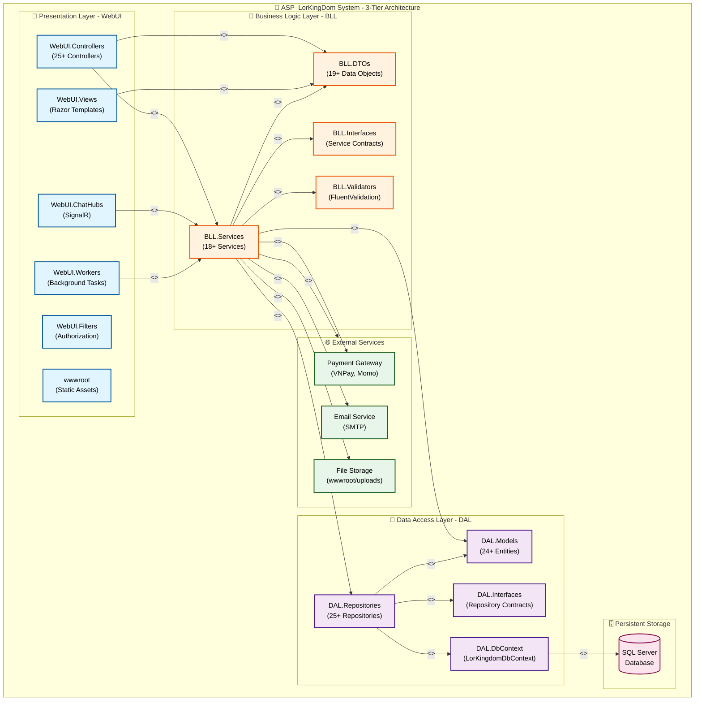
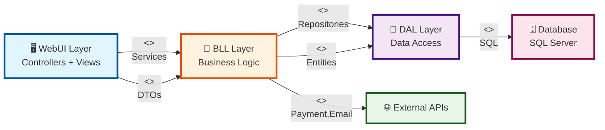
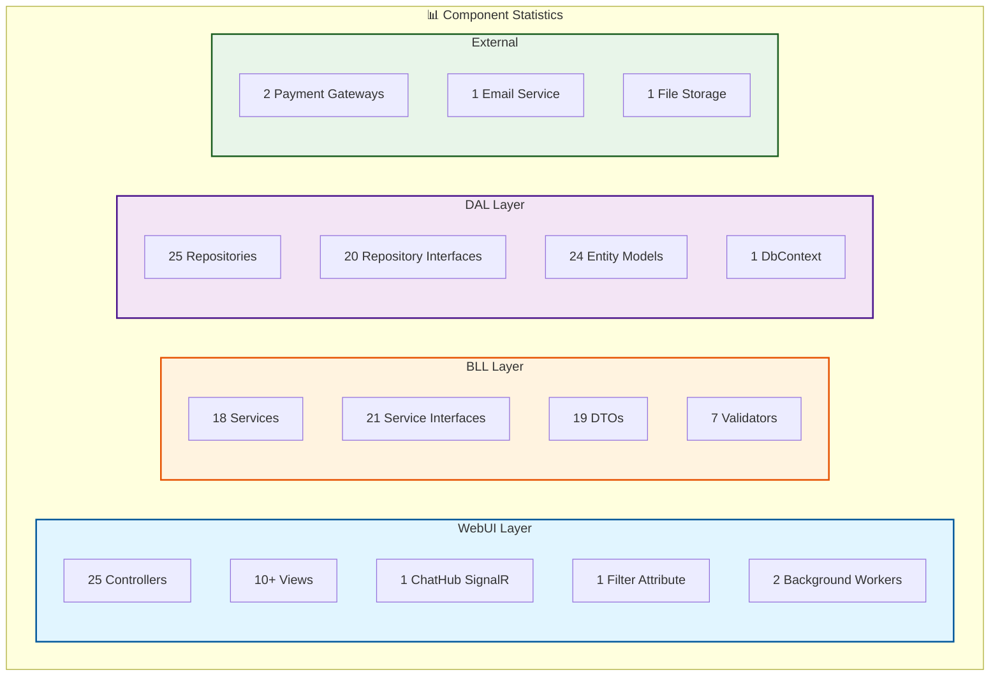
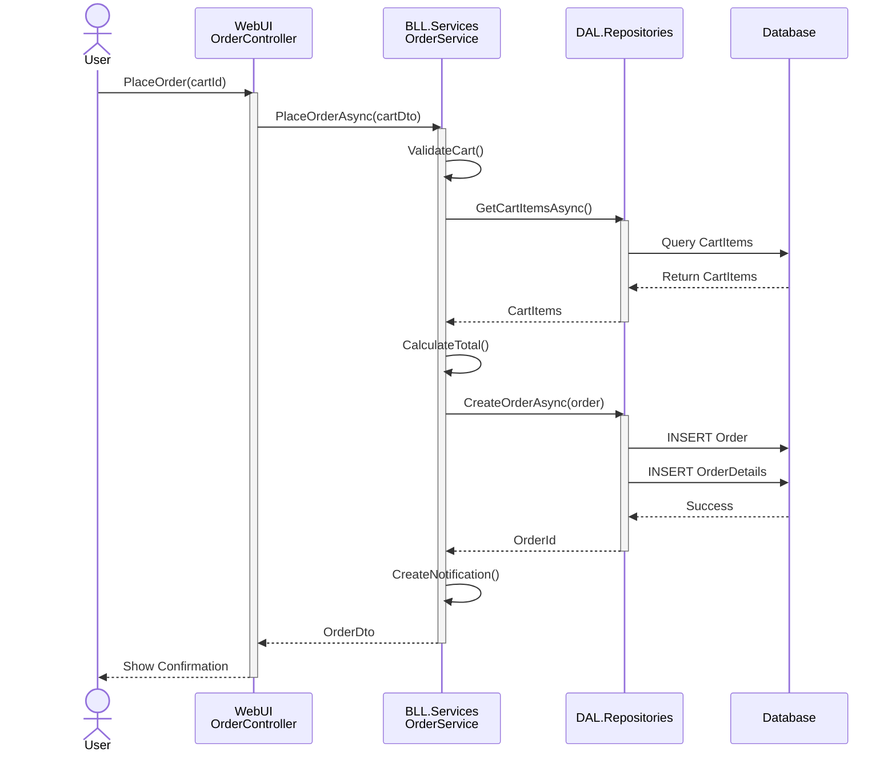
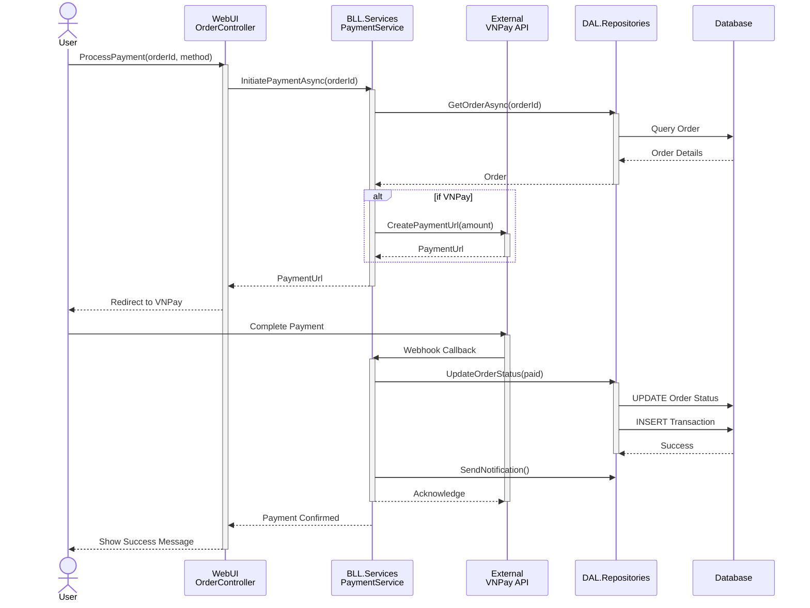
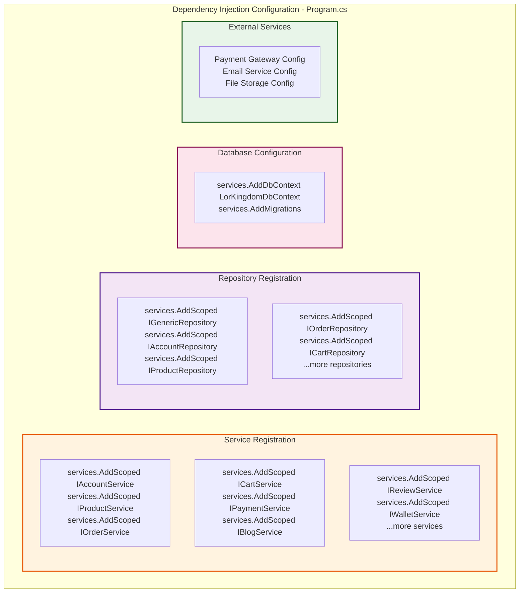
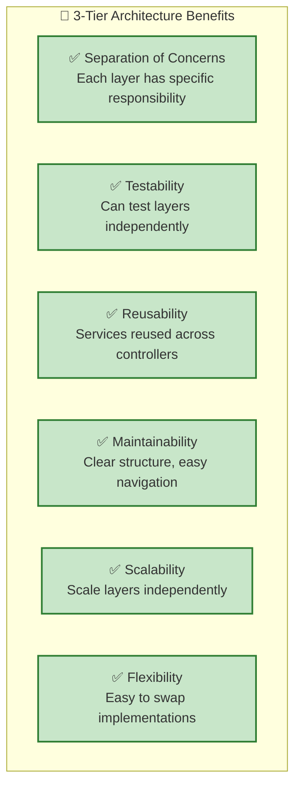

# Package Diagram - ASP_LorKingDom (Mermaid - Simplified View)

## Simplified Package Diagram - Main Layers & Dependencies

---

## Detailed Package Diagram - All Components

```mermaid
graph TB
    subgraph WebUI["WebUI - Presentation Layer"]
        subgraph Controllers["Controllers (25+)"]
            C1["AccountCustomerController<br/>AccountStaffController<br/>AdminAuthController"]
            C2["ProductController<br/>CategoryController<br/>BrandController"]
            C3["CartController<br/>OrderController<br/>OrderRefundAdminController"]
            C4["PaymentController<br/>WalletController<br/>VoucherController"]
            C5["BlogController<br/>BlogCategoryController<br/>ReviewController"]
            C6["ChatController<br/>NotificationController<br/>StatisticsController"]
        end
        
        subgraph Views["Views & Assets"]
            V1["Razor Templates:<br/>Admin, Auth, Blog, Chat<br/>Home, Wallet, Review"]
            V2["Static Assets:<br/>CSS, JS, Images<br/>Uploads"]
        end
        
        subgraph RealTime["Real-Time & Background"]
            RT["ChatHub SignalR<br/>NotificationWorkerService<br/>PromotionWorkerService"]
        end
        
        subgraph Security["Security"]
            SEC["AdminAuthorizationAttributes<br/>Role-based Access Control"]
        end
    end
    
    subgraph BLL["BLL - Business Logic Layer"]
        subgraph Services["Services (18+)"]
            S1["AccountService<br/>ProductService<br/>OrderService"]
            S2["CartService<br/>PaymentService<br/>BlogService"]
            S3["ReviewService<br/>WalletService<br/>PromotionService"]
            S4["VoucherService<br/>ChatService<br/>NotificationService"]
            S5["RefundService<br/>StatisticsService<br/>CategoryService"]
        end
        
        subgraph Interfaces["Interfaces (21)"]
            I["IAccountService<br/>IProductService<br/>IOrderService<br/>IPaymentService<br/>...and more"]
        end
        
        subgraph DTOs["DTOs (19+)"]
            D["AccountDto<br/>ProductDto<br/>OrderDto<br/>CartDto<br/>PaymentDto<br/>...and more"]
        end
        
        subgraph Validators["Validators"]
            VAL["FluentValidation<br/>AccountValidator<br/>ProductValidator<br/>OrderValidator"]
        end
    end
    
    subgraph DAL["DAL - Data Access Layer"]
        subgraph Repos["Repositories (25+)"]
            R1["GenericRepository<T><br/>AccountRepository<br/>ProductRepository"]
            R2["OrderRepository<br/>CartRepository<br/>CategoryRepository"]
            R3["BlogRepository<br/>ReviewRepository<br/>WalletRepository"]
            R4["PromotionRepository<br/>VoucherRepository<br/>ChatRepository"]
            R5["NotificationRepository<br/>RefundRequestRepository<br/>AddressRepository"]
        end
        
        subgraph RepoInterfaces["Repository Interfaces (20+)"]
            RI["IGenericRepository<T><br/>IAccountRepository<br/>IProductRepository<br/>IOrderRepository<br/>...and more"]
        end
        
        subgraph Entities["Entity Models (24+)"]
            E1["Account, Product, Order<br/>OrderDetail, Cart, CartItem"]
            E2["Category, SuperCategory<br/>Brand, Material, Origin"]
            E3["Blog, BlogCategory<br/>Review, Wallet, Transaction"]
            E4["Promotion, Voucher<br/>Chat, Message, Notification"]
            E5["RefundRequest, Wishlist<br/>Address"]
        end
        
        subgraph DbCtx["DbContext"]
            DB["LorKingdomDbContext<br/>Entity Framework Core<br/>Database Configuration<br/>Migrations"]
        end
    end
    
    subgraph Database["SQL Server Database"]
        Tables["Accounts, Products, Orders, Carts<br/>Categories, Blogs, Reviews, Wallets<br/>Promotions, Vouchers, Chats, Messages<br/>Notifications, RefundRequests, Wishlists<br/>Addresses, Brands, Materials, Origins"]
    end
    
    subgraph External["External Services"]
        Payment["VNPay Gateway<br/>Momo Gateway<br/>Payment Processing"]
        Email["SMTP Email Service<br/>Notifications<br/>Confirmations"]
        Files["File Storage<br/>Image Uploads<br/>wwwroot/uploads"]
    end
    
    %% Dependencies with arrows
    C1 -->|import| S1
    C2 -->|import| S2
    C3 -->|import| S3
    C4 -->|import| S4
    C5 -->|import| S2
    C6 -->|import| S4
    
    RT -->|import| S4
    
    V1 -->|access| D
    
    S1 -->|import| R1
    S2 -->|import| R2
    S3 -->|import| R3
    S4 -->|import| R4
    S5 -->|import| R5
    
    S1 -->|access| I
    S2 -->|access| I
    S3 -->|access| I
    S4 -->|access| I
    S5 -->|access| I
    
    S1 -->|access| VAL
    
    S1 -->|access| Payment
    S3 -->|access| Email
    S5 -->|access| Files
    
    R1 -->|import| RI
    R2 -->|import| RI
    R3 -->|import| RI
    R4 -->|import| RI
    R5 -->|import| RI
    
    R1 -->|access| E1
    R2 -->|access| E2
    R3 -->|access| E3
    R4 -->|access| E4
    R5 -->|access| E5
    
    R1 -->|access| DB
    R2 -->|access| DB
    R3 -->|access| DB
    R4 -->|access| DB
    R5 -->|access| DB
    
    DB -->|persist| Tables
    
    %% Styling
    classDef webui fill:#e1f5ff,stroke:#01579b,stroke-width:2px
    classDef bll fill:#fff3e0,stroke:#e65100,stroke-width:2px
    classDef dal fill:#f3e5f5,stroke:#4a148c,stroke-width:2px
    classDef external fill:#e8f5e9,stroke:#1b5e20,stroke-width:2px
    classDef database fill:#fce4ec,stroke:#880e4f,stroke-width:2px
    
    class WebUI,Controllers,Views,RealTime,Security webui
    class BLL,Services,Interfaces,DTOs,Validators bll
    class DAL,Repos,RepoInterfaces,Entities,DbCtx dal
    class External,Payment,Email,Files external
    class Database,Tables database
```

---

## Dependency Flow Diagram

---

## Component Count Summary

---

## Data Flow Example: Place Order

---

## Data Flow Example: Process Payment

---

## Dependency Injection Setup

---

## Architecture Benefits

---

**Version:** 1.0 - Mermaid Diagrams  
**Created:** November 5, 2025  
**Framework:** ASP.NET Core MVC 6.0+  
**Architecture:** 3-Tier Layered Architecture  
**Visualization:** Mermaid Flowcharts & Sequence Diagrams
