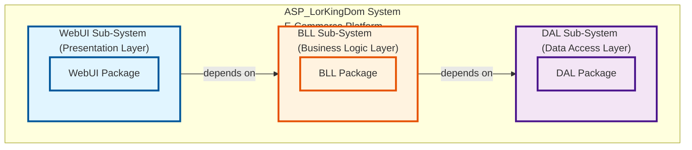
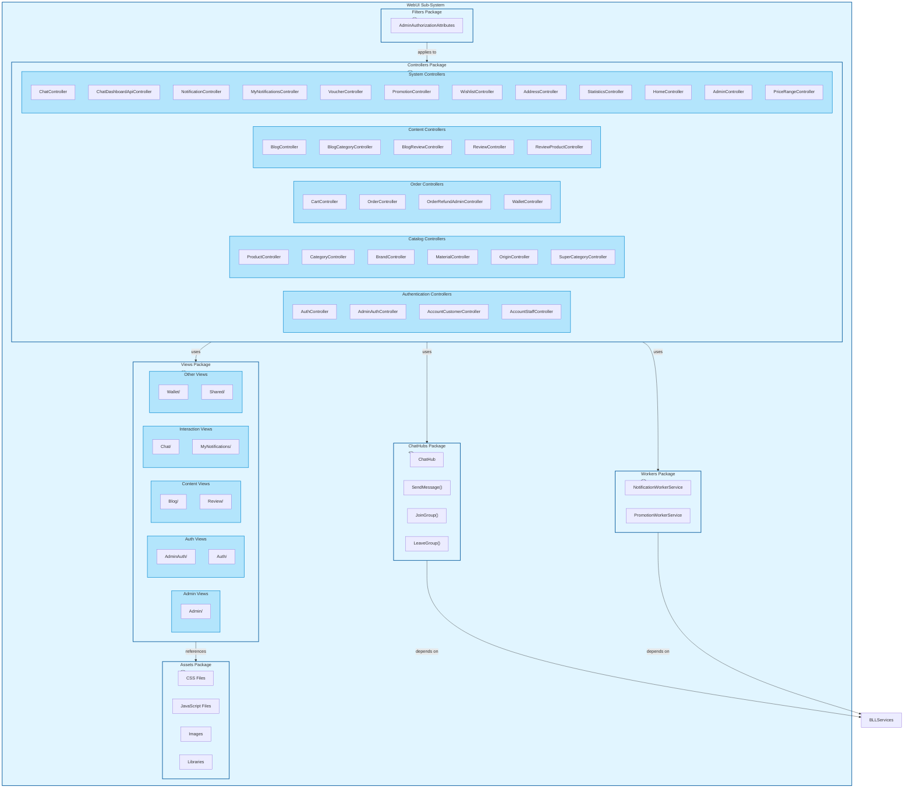
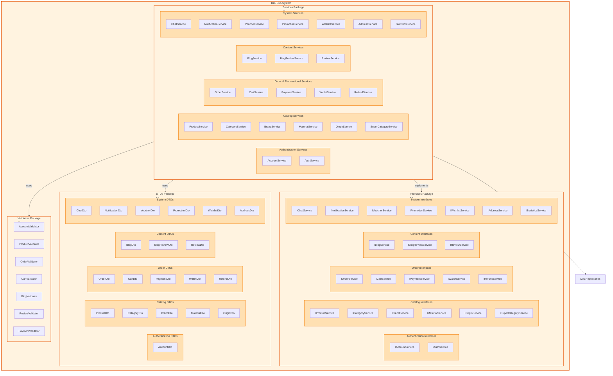
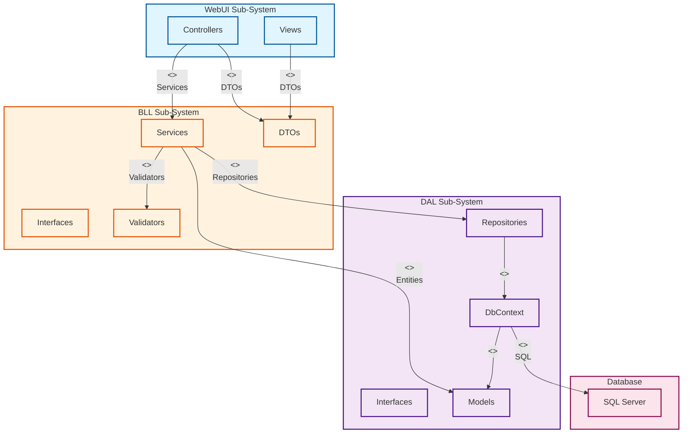
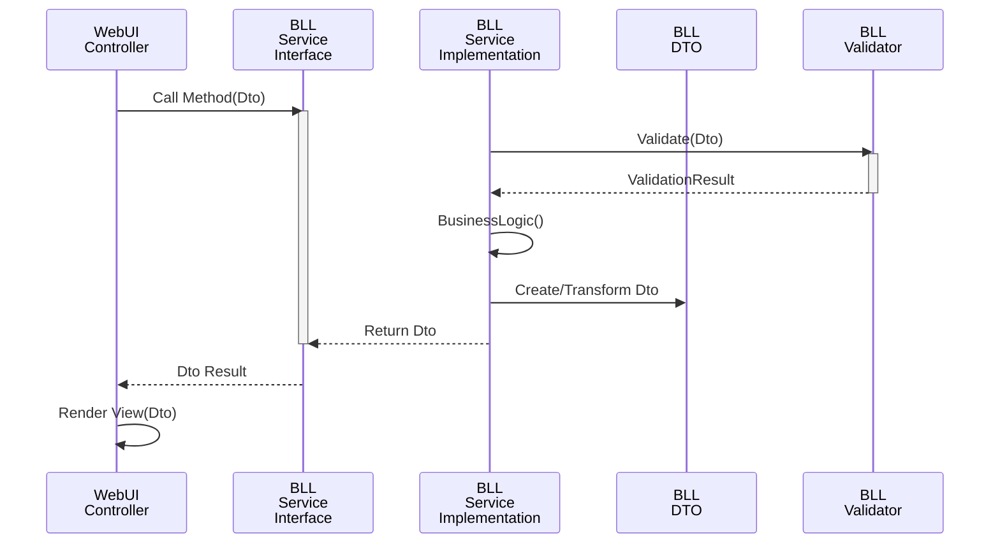
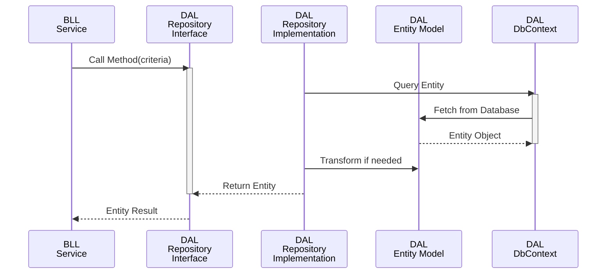

# IV.3.1. Package Diagrams for Each Sub-System - ASP_LorKingDom E-Commerce

## I. Overall System Package Architecture

### A. System Overview Diagram



---

## II. WebUI Sub-System Package Diagram

### A. WebUI Sub-System Overview



### B. WebUI Packages & Naming Conventions

| Package Name | Type | Naming Convention | Description | Examples |
|---|---|---|---|---|
| **Controllers** | Component Package | `{Subject}Controller` | MVC Controllers handling HTTP requests | `ProductController`, `OrderController` |
| **Views** | Template Package | `{Feature}/` | Razor template views organized by feature | `Admin/`, `Auth/`, `Blog/` |
| **ChatHubs** | SignalR Package | `{Hub}Hub` | Real-time communication hubs | `ChatHub` |
| **Filters** | Security Package | `{Action}Attributes` | Authorization and action filters | `AdminAuthorizationAttributes` |
| **Workers** | Background Package | `{Task}WorkerService` | Background services implementing IHostedService | `NotificationWorkerService` |
| **wwwroot** | Assets Package | `{Type}/` | Static files organized by type | `css/`, `js/`, `uploads/` |

### C. WebUI Package Dependencies

```
Controllers
  └─ Depends on → BLL.Services (via Dependency Injection)
  └─ Uses → Views
  └─ Uses → Filters
  └─ Uses → Workers

Views
  └─ References → Static Assets
  └─ Uses → Models/DTOs

ChatHubs
  └─ Depends on → BLL.Services
  └─ Uses → SignalR Protocol

Filters
  └─ Applies to → Controllers
  └─ Enforces → Authorization Rules

Workers
  └─ Depends on → BLL.Services
  └─ Implements → IHostedService
```

---

## III. BLL Sub-System Package Diagram

### A. BLL Sub-System Overview



### B. BLL Packages & Naming Conventions

| Package Name | Type | Naming Convention | Description | Examples |
|---|---|---|---|---|
| **Services** | Implementation Package | `{Domain}Service` | Business logic implementations | `ProductService`, `OrderService` |
| **Interfaces** | Contract Package | `I{Domain}Service` | Service interfaces for abstraction | `IProductService`, `IOrderService` |
| **DTOs** | Data Package | `{Domain}Dto` | Data transfer objects for inter-layer communication | `ProductDto`, `OrderDto` |
| **Validators** | Validation Package | `{Domain}Validator` | FluentValidation validators | `ProductValidator`, `OrderValidator` |

### C. BLL Package Dependencies

```
Services (Implementations)
  ├─ Implements → Interfaces
  ├─ Uses → DTOs
  ├─ Uses → Validators
  └─ Depends on → DAL.Repositories

Interfaces (Contracts)
  └─ Defines → Service Contracts
  └─ Located in → BLL.Interfaces

DTOs (Data Objects)
  └─ Used for → Data Transfer
  └─ Decouple → Layers

Validators (Validation)
  └─ Validates → DTOs
  └─ Uses → FluentValidation Framework
```

---

## IV. DAL Sub-System Package Diagram

### A. DAL Sub-System Overview

```mermaid
graph TB
    subgraph DALSubsystem["DAL Sub-System<br/>💾 Data Access Layer"]
        
        subgraph Repositories["Repositories Package<br/><<repositories>>"]
            subgraph AuthRepositories["Authentication Repositories"]
                RAC["AccountRepository"]
            end
            
            subgraph CatalogRepositories["Catalog Repositories"]
                RP["ProductRepository"]
                RC["CategoryRepository"]
                RB["BrandRepository"]
                RM["MaterialRepository"]
                RO["OriginRepository"]
                RSC["SuperCategoryRepository"]
            end
            
            subgraph OrderRepositories["Order Repositories"]
                ROR["OrderRepository"]
                RORD["OrderDetailRepository"]
                RCART["CartRepository"]
                RCI["CartItemRepository"]
                RW["WalletRepository"]
                RT["TransactionRepository"]
            end
            
            subgraph ContentRepositories["Content Repositories"]
                RB2["BlogRepository"]
                RBC["BlogCategoryRepository"]
                RRV["ReviewRepository"]
            end
            
            subgraph SystemRepositories["System Repositories"]
                RCH["ChatRepository"]
                RME["MessageRepository"]
                RNO["NotificationRepository"]
                RRE["RefundRequestRepository"]
                RVO["VoucherRepository"]
                RPR["PromotionRepository"]
                RWL["WishlistRepository"]
                RA["AddressRepository"]
            end
            
            subgraph GenericRepositories["Generic Repositories"]
                RG["GenericRepository<T>"]
            end
        end
        
        subgraph Interfaces["Interfaces Package<br/><<interfaces>>"]
            subgraph AuthRepositoryInterfaces["Authentication Interfaces"]
                IRA["IAccountRepository"]
            end
            
            subgraph CatalogRepositoryInterfaces["Catalog Interfaces"]
                IRP["IProductRepository"]
                IRC["ICategoryRepository"]
                IRB["IBrandRepository"]
                IRM["IMaterialRepository"]
                IRO["IOriginRepository"]
                IRSC["ISuperCategoryRepository"]
            end
            
            subgraph OrderRepositoryInterfaces["Order Interfaces"]
                IROR["IOrderRepository"]
                IRCART["ICartRepository"]
                IRW["IWalletRepository"]
            end
            
            subgraph ContentRepositoryInterfaces["Content Interfaces"]
                IRB2["IBlogRepository"]
                IRRV["IReviewRepository"]
            end
            
            subgraph SystemRepositoryInterfaces["System Interfaces"]
                IRCH["IChatRepository"]
                IRNO["INotificationRepository"]
                IRRE["IRefundRequestRepository"]
                IRVO["IVoucherRepository"]
                IRPR["IPromotionRepository"]
                IRWL["IWishlistRepository"]
                IRA2["IAddressRepository"]
            end
            
            subgraph GenericRepositoryInterfaces["Generic Interfaces"]
                IRG["IGenericRepository<T>"]
            end
        end
        
        subgraph Models["Models Package<br/><<entity-models>>"]
            subgraph AuthModels["Authentication Models"]
                MAC["Account"]
            end
            
            subgraph CatalogModels["Catalog Models"]
                MP["Product"]
                MC["Category"]
                MB["Brand"]
                MM["Material"]
                MO["Origin"]
                MSC["SuperCategory"]
            end
            
            subgraph OrderModels["Order Models"]
                MOR["Order"]
                MORD["OrderDetail"]
                MCR["Cart"]
                MCI["CartItem"]
                MW["Wallet"]
                MT["Transaction"]
            end
            
            subgraph ContentModels["Content Models"]
                MB2["Blog"]
                MBC["BlogCategory"]
                MRV["Review"]
            end
            
            subgraph SystemModels["System Models"]
                MCH["Chat"]
                MME["Message"]
                MNO["Notification"]
                MRE["RefundRequest"]
                MVO["Voucher"]
                MPR["Promotion"]
                MWL["Wishlist"]
                MA["Address"]
            end
        end
        
        subgraph DbContext["DbContext Package<br/><<entity-framework>>"]
            LKC["LorKingdomDbContext"]
            EFC["Entity Framework Core"]
            DBM["Database Migrations"]
            DBS["Data Seeding"]
        end
        
        subgraph Database["Database<br/><<sql-server>>"]
            DB[(SQL Server Database<br/>LorKingdom)]
            TBL["Database Tables & Views"]
        end
    end
    
    Repositories -->|"implements"| Interfaces
    Repositories -->|"uses"| Models
    Repositories -->|"uses"| DbContext
    Models -->|"mapped by"| DbContext
    DbContext -->|"accesses"| Database
    GenericRepositories -->|"extended by"| Repositories
    GenericRepositoryInterfaces -->|"implemented by"| GenericRepositories
    
    classDef package fill:#f3e5f5,stroke:#4a148c,stroke-width:2px
    classDef subpackage fill:#e1bee7,stroke:#7b1fa2,stroke-width:1.5px
    
    class DALSubsystem,Repositories,Interfaces,Models,DbContext,Database package
    class AuthRepositories,CatalogRepositories,OrderRepositories,ContentRepositories,SystemRepositories,GenericRepositories subpackage
    class AuthRepositoryInterfaces,CatalogRepositoryInterfaces,OrderRepositoryInterfaces,ContentRepositoryInterfaces,SystemRepositoryInterfaces,GenericRepositoryInterfaces subpackage
    class AuthModels,CatalogModels,OrderModels,ContentModels,SystemModels subpackage
```



### B. DAL Packages & Naming Conventions

| Package Name | Type | Naming Convention | Description | Examples |
|---|---|---|---|---|
| **Repositories** | Implementation Package | `{Domain}Repository` | Repository implementations for data access | `ProductRepository`, `OrderRepository` |
| **Interfaces** | Contract Package | `I{Domain}Repository` | Repository interfaces for abstraction | `IProductRepository`, `IOrderRepository` |
| **Models** | Entity Package | `{Domain}` (singular) | EF Core entity models | `Product`, `Order`, `Account` |
| **DbContext** | Context Package | `{Domain}DbContext` | Entity Framework DbContext | `LorKingdomDbContext` |

### C. DAL Package Dependencies

```
Repositories (Implementations)
  ├─ Implements → Interfaces
  ├─ Uses → Models (Entity Models)
  ├─ Uses → DbContext (for data access)
  └─ Extends → GenericRepository<T>

Interfaces (Contracts)
  └─ Defines → Repository Contracts
  └─ Located in → DAL.Interfaces

Models (Entities)
  ├─ Mapped to → Database Tables
  ├─ Used by → Repositories
  └─ Referenced in → DbContext

DbContext (Context)
  ├─ Manages → Entity Models
  ├─ Configures → Database Mappings
  ├─ Handles → Migrations
  └─ Accesses → Database

Database
  └─ Stores → Data for all entities
```

---

## V. Cross-System Dependencies & Interactions

### A. System Dependency Flow Diagram



---

## VI. Naming Conventions Summary Table

### A. Class Naming Conventions by Sub-System

| Sub-System | Component | Naming Pattern | Example | Purpose |
|---|---|---|---|---|
| **WebUI** | Controller | `{Feature}Controller` | `ProductController` | Handles HTTP requests for a feature |
| **WebUI** | View/Page | `{FeatureName}.cshtml` | `Product.cshtml` | Renders UI for user interaction |
| **WebUI** | SignalR Hub | `{Domain}Hub` | `ChatHub` | Real-time communication server |
| **WebUI** | Filter/Attribute | `{Action}Attributes` | `AdminAuthorizationAttributes` | Cross-cutting concerns |
| **WebUI** | Background Service | `{Task}WorkerService` | `NotificationWorkerService` | Scheduled background tasks |
| **BLL** | Service | `{Domain}Service` | `ProductService` | Core business logic implementation |
| **BLL** | Service Interface | `I{Domain}Service` | `IProductService` | Service contract definition |
| **BLL** | DTO | `{Domain}Dto` | `ProductDto` | Data transfer between layers |
| **BLL** | Validator | `{Domain}Validator` | `ProductValidator` | Input validation rules |
| **DAL** | Repository | `{Domain}Repository` | `ProductRepository` | Data access for entity |
| **DAL** | Repository Interface | `I{Domain}Repository` | `IProductRepository` | Repository contract definition |
| **DAL** | Entity Model | `{Domain}` (singular) | `Product` | Database entity mapping |
| **DAL** | DbContext | `{DomainName}DbContext` | `LorKingdomDbContext` | Entity Framework context |

### B. Package/Folder Naming Conventions by Sub-System

| Sub-System | Package | Naming Pattern | Example | Organization |
|---|---|---|---|---|
| **WebUI** | Controllers | `Controllers/` | Controllers/{Feature}/ | By feature domain |
| **WebUI** | Views | `Views/` | Views/{Feature}/ | By feature domain |
| **WebUI** | ChatHubs | `ChatHubs/` | ChatHubs/ | SignalR hubs |
| **WebUI** | Filters | `Filters/` | Filters/ | Security filters |
| **WebUI** | Workers | `Workers/` | Workers/ | Background services |
| **WebUI** | Static | `wwwroot/` | wwwroot/{type}/ | Static assets by type |
| **BLL** | Services | `Services/` | Services/{Feature}/ | By feature domain |
| **BLL** | Interfaces | `Interfaces/` | Interfaces/ | Service contracts |
| **BLL** | DTOs | `DTOs/` | DTOs/{Feature}/ | By feature domain |
| **BLL** | Validators | `Validators/` | Validators/ | Validation rules |
| **DAL** | Repositories | `Repositories/` | Repositories/{Feature}/ | By feature domain |
| **DAL** | Interfaces | `Interfaces/` | Interfaces/ | Repository contracts |
| **DAL** | Models | `Models/` | Models/{Feature}/ | By feature domain |
| **DAL** | DbContext | `DbContext/` | DbContext/ | Entity Framework context |

---

## VII. Sub-System Communication Patterns

### A. WebUI → BLL Communication Pattern



**Naming Convention in Communication:**
- `IProductService.GetProductAsync()`
- `ProductDto` (input/output)
- `ProductValidator` (validates input)

### B. BLL → DAL Communication Pattern



**Naming Convention in Communication:**
- `IProductRepository.GetProductAsync(id)`
- `Product` (entity model)
- `Product` mapped to database table

---

## VIII. Package Interaction Matrix

| From Package | To Package | Interaction Type | Communication | Example |
|---|---|---|---|---|
| Controllers | Services | Method Call | DI Injection | `_productService.GetProductAsync()` |
| Services | Repositories | Method Call | DI Injection | `_productRepository.GetByIdAsync()` |
| Services | DTOs | Object Creation | Direct | `new ProductDto()` |
| Services | Validators | Method Call | DI Injection | `validator.Validate(dto)` |
| Repositories | Models | Object Mapping | EF Core | `DbSet<Product>.ToList()` |
| Repositories | DbContext | Query/Persist | Direct | `_context.Products.Add()` |
| Views | DTOs | Data Binding | ASP.NET | `@Model` (ProductDto) |
| ChatHub | Services | Method Call | DI Injection | `_chatService.SendMessage()` |
| Workers | Services | Method Call | DI Injection | `_notificationService.SendNotifications()` |

---

## IX. Detailed Package Contents by Sub-System

### A. WebUI Package Contents

```
WebUI (WebUI.csproj)
├── Controllers/ (25+ controllers)
│   ├── Authentication/
│   │   ├── AuthController
│   │   ├── AdminAuthController
│   │   ├── AccountCustomerController
│   │   └── AccountStaffController
│   ├── Catalog/
│   │   ├── ProductController
│   │   ├── CategoryController
│   │   ├── BrandController
│   │   ├── MaterialController
│   │   ├── OriginController
│   │   └── SuperCategoryController
│   ├── Orders/
│   │   ├── OrderController
│   │   ├── CartController
│   │   ├── OrderRefundAdminController
│   │   └── WalletController
│   └── System/
│       ├── ChatController
│       ├── NotificationController
│       ├── PromotionController
│       ├── VoucherController
│       ├── StatisticsController
│       └── HomeController
├── Views/
│   ├── Admin/
│   ├── Auth/
│   ├── Blog/
│   ├── Chat/
│   ├── Shared/
│   └── Wallet/
├── ChatHubs/
│   └── ChatHub.cs
├── Filters/
│   └── AdminAuthorizationAttributes.cs
├── Workers/
│   ├── NotificationWorkerService.cs
│   └── PromotionWorkerService.cs
└── wwwroot/
    ├── css/
    ├── js/
    ├── lib/
    └── uploads/
```

### B. BLL Package Contents

```
BLL (BLL.csproj)
├── Services/
│   ├── AccountService.cs
│   ├── ProductService.cs
│   ├── OrderService.cs
│   ├── CartService.cs
│   ├── PaymentService.cs
│   ├── BlogService.cs
│   ├── ReviewService.cs
│   ├── WalletService.cs
│   ├── PromotionService.cs
│   ├── VoucherService.cs
│   ├── ChatService.cs
│   ├── NotificationService.cs
│   ├── RefundService.cs
│   ├── StatisticsService.cs
│   ├── CategoryService.cs
│   ├── BrandService.cs
│   ├── MaterialService.cs
│   ├── OriginService.cs
│   ├── AddressService.cs
│   ├── WishlistService.cs
│   └── SuperCategoryService.cs
├── Interfaces/
│   ├── IAccountService.cs
│   ├── IProductService.cs
│   ├── IOrderService.cs
│   ├── ICartService.cs
│   ├── IPaymentService.cs
│   └── ... (20+ interfaces)
├── DTOs/
│   ├── AccountDto.cs
│   ├── ProductDto.cs
│   ├── OrderDto.cs
│   ├── CartDto.cs
│   ├── BlogDto.cs
│   ├── ReviewDto.cs
│   ├── WalletDto.cs
│   ├── ChatDto.cs
│   └── ... (12+ DTOs)
└── Validators/
    ├── AccountValidator.cs
    ├── ProductValidator.cs
    ├── OrderValidator.cs
    ├── CartValidator.cs
    ├── BlogValidator.cs
    ├── ReviewValidator.cs
    └── PaymentValidator.cs
```

### C. DAL Package Contents

```
DAL (DAL.csproj)
├── Repositories/
│   ├── GenericRepository<T>.cs
│   ├── AccountRepository.cs
│   ├── ProductRepository.cs
│   ├── OrderRepository.cs
│   ├── CartRepository.cs
│   ├── CategoryRepository.cs
│   ├── BlogRepository.cs
│   ├── ReviewRepository.cs
│   ├── WalletRepository.cs
│   ├── PromotionRepository.cs
│   ├── VoucherRepository.cs
│   ├── ChatRepository.cs
│   ├── NotificationRepository.cs
│   ├── RefundRequestRepository.cs
│   └── ... (10+ repositories)
├── Interfaces/
│   ├── IGenericRepository<T>.cs
│   ├── IAccountRepository.cs
│   ├── IProductRepository.cs
│   ├── IOrderRepository.cs
│   ├── ICartRepository.cs
│   └── ... (20+ interfaces)
├── Models/
│   ├── Account.cs
│   ├── Product.cs
│   ├── Order.cs
│   ├── OrderDetail.cs
│   ├── Cart.cs
│   ├── CartItem.cs
│   ├── Category.cs
│   ├── SuperCategory.cs
│   ├── Brand.cs
│   ├── Material.cs
│   ├── Origin.cs
│   ├── Blog.cs
│   ├── BlogCategory.cs
│   ├── Review.cs
│   ├── Wallet.cs
│   ├── Transaction.cs
│   ├── Promotion.cs
│   ├── Voucher.cs
│   ├── Chat.cs
│   ├── Message.cs
│   ├── Notification.cs
│   ├── RefundRequest.cs
│   ├── Wishlist.cs
│   └── Address.cs
└── DbContext/
    └── LorKingdomDbContext.cs
```

---

## X. Dependency Constraints & Rules

### A. Valid Dependencies (Allowed)

```
✓ Controllers → Services (via DI)
✓ Controllers → DTOs
✓ Views → DTOs
✓ Services → Repositories (via DI)
✓ Services → DTOs
✓ Services → Validators
✓ Repositories → Models
✓ Repositories → DbContext
✓ DbContext → Models
✓ Workers → Services (via DI)
✓ Hubs → Services (via DI)
```

### B. Invalid Dependencies (NOT Allowed)

```
✗ Controllers → Repositories (bypass BLL)
✗ Views → Services (should use Controllers)
✗ Services → Controllers (reverse dependency)
✗ Repositories → Services (reverse dependency)
✗ Models → Services (should flow through Repository)
✗ DAL → BLL (reverse dependency)
✗ WebUI → Database (no direct connection)
✗ Circular dependencies at any level
```

---

## XI. Summary Table - Sub-System Overview

| Aspect | WebUI | BLL | DAL |
|---|---|---|---|
| **Purpose** | User Interface | Business Rules | Data Persistence |
| **Main Packages** | Controllers, Views, Hubs | Services, DTOs, Validators | Repositories, Models, DbContext |
| **Technology** | ASP.NET Core MVC, Razor, SignalR | C#, FluentValidation | Entity Framework Core, SQL Server |
| **Key Responsibility** | Request/Response Handling | Business Logic & Validation | Database Access & Mapping |
| **Naming Convention** | `{Feature}Controller` | `{Domain}Service` | `{Domain}Repository` |
| **Communication** | HTTP/WebSocket | Method Calls (DI) | LINQ/SQL |
| **Dependencies** | Depends on BLL | Depends on DAL | No dependencies (on features) |
| **Testing** | Integration/UI Tests | Unit Tests | Unit Tests |

---

**Version:** 1.0  
**Created:** November 5, 2025  
**Framework:** ASP.NET Core MVC 6.0+  
**Architecture:** 3-Tier Layered Architecture with Sub-Systems  
**Documentation:** Complete Package Diagrams for Each Sub-System
