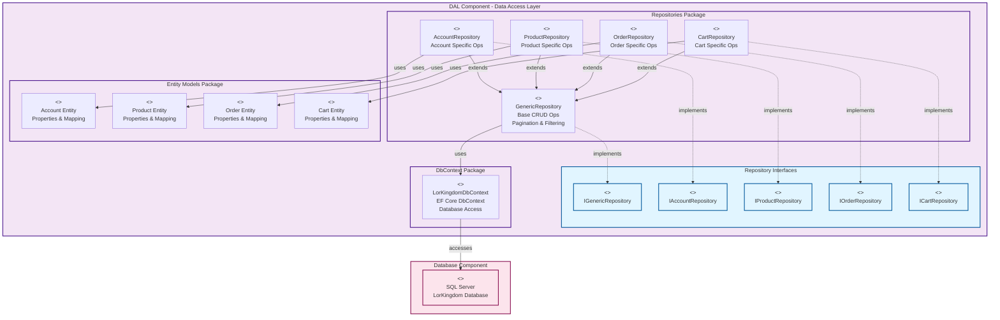
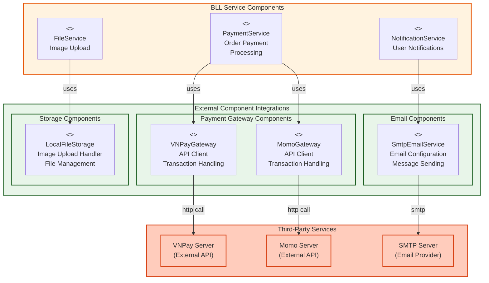
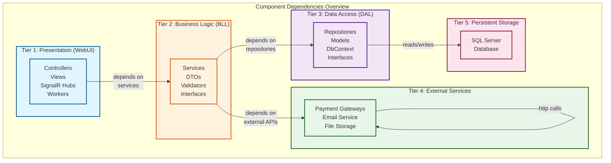
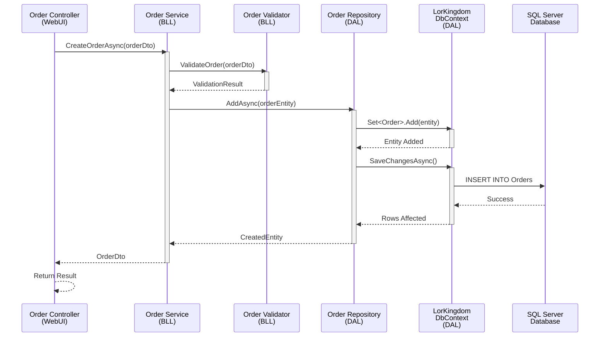
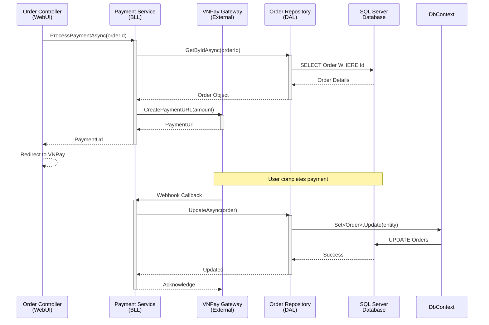
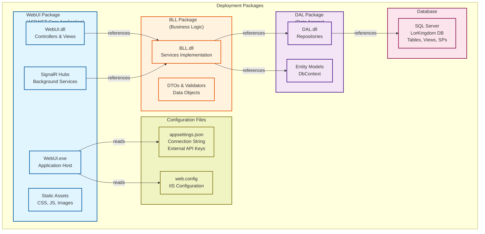
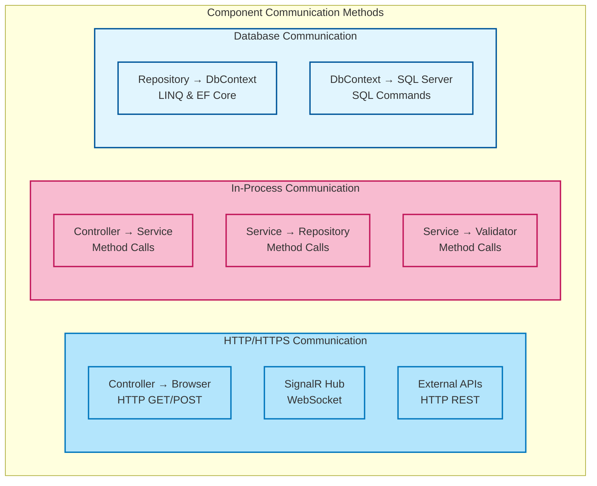

# IV.3.2. Component Diagram - ASP_LorKingDom E-Commerce System

## I. Giới thiệu về Component Diagram

**Component Diagram** là một loại biểu đồ UML được sử dụng để hiển thị các thành phần vật lý (physical components) của hệ thống và các mối quan hệ phụ thuộc giữa chúng. Nó giúp:
- Visualize cấu trúc vật lý của hệ thống
- Hiển thị các assembly, DLL, JAR files, v.v.
- Xác định các interface được công bố
- Hiểu mối quan hệ giữa các components
- Lập kế hoạch triển khai (deployment)

---

## II. Component Diagram - Mermaid Visualization

### A. Tổng Quan Toàn Hệ Thống

```mermaid
graph TB
    subgraph System["ASP_LorKingDom System - Component View"]
        
        subgraph WebUIComponent["WebUI Component (WebUI.csproj)"]
            subgraph WebUIControllers["[Controllers]"]
                CMP1["<<component>><br/>AccountCustomerController<br/>AccountStaffController<br/>AdminAuthController<br/>AdminController<br/>AuthController"]
                CMP2["<<component>><br/>ProductController<br/>CategoryController<br/>BrandController<br/>MaterialController<br/>OriginController"]
                CMP3["<<component>><br/>CartController<br/>OrderController<br/>OrderRefundAdminController<br/>WalletController"]
                CMP4["<<component>><br/>BlogController<br/>BlogCategoryController<br/>BlogReviewController<br/>ReviewController"]
                CMP5["<<component>><br/>ChatController<br/>ChatDashboardApiController<br/>MyNotificationsController<br/>NotificationController"]
                CMP6["<<component>><br/>VoucherController<br/>PromotionController<br/>WishlistController<br/>AddressController<br/>StatisticsController"]
            end
            
            subgraph WebUIViews["[Views & Razor Pages]"]
                VIEW1["<<component>><br/>Admin Views"]
                VIEW2["<<component>><br/>Auth Views"]
                VIEW3["<<component>><br/>Blog Views"]
                VIEW4["<<component>><br/>Product Views"]
                VIEW5["<<component>><br/>Cart & Order Views"]
                VIEW6["<<component>><br/>Chat & Notification Views"]
            end
            
            subgraph WebUIHub["[SignalR Hubs]"]
                HUB1["<<component>><br/>ChatHub<br/>Real-time Messaging"]
            end
            
            subgraph WebUIFilters["[Filters & Attributes]"]
                FLT1["<<component>><br/>AdminAuthorizationAttributes<br/>Authorization Filter"]
            end
            
            subgraph WebUIWorkers["[Background Services]"]
                WRK1["<<component>><br/>NotificationWorkerService"]
                WRK2["<<component>><br/>PromotionWorkerService"]
            end
            
            subgraph WebUIAssets["[Static Assets]"]
                ASS1["<<component>><br/>CSS Files<br/>Bootstrap & Custom"]
                ASS2["<<component>><br/>JavaScript Files<br/>jQuery & Custom"]
                ASS3["<<component>><br/>Images & Uploads"]
                ASS4["<<component>><br/>Libraries<br/>Bootstrap, jQuery"]
            end
        end
        
        subgraph BLLComponent["BLL Component (BLL.csproj)"]
            subgraph BLLServiceComps["[Service Components]"]
                SVC1["<<component>><br/>AccountService<br/>ProductService<br/>OrderService"]
                SVC2["<<component>><br/>CartService<br/>PaymentService<br/>BlogService"]
                SVC3["<<component>><br/>ReviewService<br/>WalletService<br/>PromotionService"]
                SVC4["<<component>><br/>VoucherService<br/>ChatService<br/>NotificationService"]
                SVC5["<<component>><br/>RefundService<br/>StatisticsService"]
            end
            
            subgraph BLLInterfaceComps["[Interface Components]"]
                INT1["<<interface>><br/>IAccountService<br/>IProductService<br/>IOrderService<br/>ICartService"]
                INT2["<<interface>><br/>IPaymentService<br/>IBlogService<br/>IReviewService<br/>IWalletService"]
                INT3["<<interface>><br/>IPromotionService<br/>IVoucherService<br/>IChatService"]
                INT4["<<interface>><br/>INotificationService<br/>IRefundService<br/>IStatisticsService"]
            end
            
            subgraph BLLDTOComps["[DTO Components]"]
                DTO1["<<component>><br/>AccountDto<br/>ProductDto<br/>OrderDto<br/>CartDto"]
                DTO2["<<component>><br/>BlogDto<br/>ReviewDto<br/>WalletDto<br/>ChatDto"]
                DTO3["<<component>><br/>NotificationDto<br/>VoucherDto<br/>PromotionDto<br/>RefundDto"]
            end
            
            subgraph BLLValidatorComps["[Validator Components]"]
                VAL1["<<component>><br/>FluentValidation<br/>Validators<br/>AccountValidator<br/>ProductValidator<br/>OrderValidator"]
            end
        end
        
        subgraph DALComponent["DAL Component (DAL.csproj)"]
            subgraph DALRepositoryComps["[Repository Components]"]
                REP1["<<component>><br/>GenericRepository<T><br/>Base CRUD Operations"]
                REP2["<<component>><br/>AccountRepository<br/>ProductRepository<br/>OrderRepository"]
                REP3["<<component>><br/>CartRepository<br/>CategoryRepository<br/>BlogRepository"]
                REP4["<<component>><br/>ReviewRepository<br/>WalletRepository<br/>PromotionRepository"]
                REP5["<<component>><br/>VoucherRepository<br/>ChatRepository<br/>NotificationRepository"]
            end
            
            subgraph DALInterfaceComps["[Repository Interface Components]"]
                REPI1["<<interface>><br/>IGenericRepository<T><br/>IAccountRepository<br/>IProductRepository"]
                REPI2["<<interface>><br/>IOrderRepository<br/>ICartRepository<br/>ICategoryRepository"]
                REPI3["<<interface>><br/>IBlogRepository<br/>IReviewRepository<br/>IWalletRepository"]
                REPI4["<<interface>><br/>IPromotionRepository<br/>IVoucherRepository<br/>IChatRepository"]
            end
            
            subgraph DALModelComps["[Entity Model Components]"]
                MDL1["<<component>><br/>Account Entity<br/>Product Entity<br/>Order Entity"]
                MDL2["<<component>><br/>Cart Entity<br/>Category Entity<br/>Blog Entity"]
                MDL3["<<component>><br/>Review Entity<br/>Wallet Entity<br/>Promotion Entity"]
                MDL4["<<component>><br/>Voucher Entity<br/>Chat Entity<br/>Message Entity<br/>Notification Entity"]
            end
            
            subgraph DALDbCtxComp["[DbContext Component]"]
                DBX["<<component>><br/>LorKingdomDbContext<br/>Entity Framework Core<br/>Database Mappings"]
            end
        end
        
        subgraph ExternalComponent["External Components"]
            subgraph PaymentComps["[Payment Gateway]"]
                PAY1["<<component>><br/>VNPay Gateway<br/>Payment Processing<br/>API Integration"]
                PAY2["<<component>><br/>Momo Gateway<br/>Payment Processing<br/>API Integration"]
            end
            
            subgraph EmailComps["[Email Service]"]
                EMAIL["<<component>><br/>SMTP Service<br/>Email Notifications<br/>Configuration"]
            end
            
            subgraph StorageComps["[File Storage]"]
                STORE["<<component>><br/>File Storage Service<br/>Image Upload Handler<br/>Local Storage"]
            end
        end
        
        subgraph DatabaseComponent["Database Component (SQL Server)"]
            DB["<<database>><br/>LorKingdom Database<br/>All Tables & Views"]
        end
        
        subgraph ExternalServices["External Services"]
            VNPAPI["VNPay Server"]
            MMOAPI["Momo Server"]
            SMTPSVR["SMTP Server"]
        end
    end
    
    %% Dependencies - WebUI to BLL
    CMP1 -->|depends| SVC1
    CMP2 -->|depends| SVC2
    CMP3 -->|depends| SVC3
    CMP4 -->|depends| SVC2
    CMP5 -->|depends| SVC4
    CMP6 -->|depends| SVC5
    
    HUB1 -->|depends| SVC4
    WRK1 -->|depends| SVC4
    WRK2 -->|depends| SVC3
    
    VIEW1 -->|depends| DTO1
    VIEW2 -->|depends| DTO1
    VIEW3 -->|depends| DTO2
    VIEW4 -->|depends| DTO1
    VIEW5 -->|depends| DTO1
    VIEW6 -->|depends| DTO2
    
    %% Dependencies - BLL to DAL
    SVC1 -->|depends| REP2
    SVC1 -->|depends| INT1
    SVC2 -->|depends| REP2
    SVC2 -->|depends| INT2
    SVC3 -->|depends| REP4
    SVC3 -->|depends| INT2
    SVC4 -->|depends| REP5
    SVC4 -->|depends| INT3
    SVC5 -->|depends| REP4
    SVC5 -->|depends| INT4
    
    VAL1 -->|validates| DTO1
    VAL1 -->|validates| DTO2
    
    %% Dependencies - DAL
    REP2 -->|depends| REPI1
    REP3 -->|depends| REPI2
    REP4 -->|depends| REPI3
    REP5 -->|depends| REPI4
    
    REP1 -->|uses| MDL1
    REP2 -->|uses| MDL1
    REP3 -->|uses| MDL2
    REP4 -->|uses| MDL3
    REP5 -->|uses| MDL4
    
    REP1 -->|uses| DBX
    REP2 -->|uses| DBX
    REP3 -->|uses| DBX
    REP4 -->|uses| DBX
    REP5 -->|uses| DBX
    
    DBX -->|access| DB
    
    %% Dependencies - External Services
    SVC2 -->|calls| PAY1
    SVC2 -->|calls| PAY2
    SVC3 -->|calls| EMAIL
    SVC5 -->|calls| STORE
    
    PAY1 -->|http| VNPAPI
    PAY2 -->|http| MMOAPI
    EMAIL -->|smtp| SMTPSVR
    
    %% Styling
    classDef webui fill:#e1f5ff,stroke:#01579b,stroke-width:2px
    classDef bll fill:#fff3e0,stroke:#e65100,stroke-width:2px
    classDef dal fill:#f3e5f5,stroke:#4a148c,stroke-width:2px
    classDef external fill:#e8f5e9,stroke:#1b5e20,stroke-width:2px
    classDef database fill:#fce4ec,stroke:#880e4f,stroke-width:2px
    
    class WebUIComponent,WebUIControllers,WebUIViews,WebUIHub,WebUIFilters,WebUIWorkers,WebUIAssets webui
    class BLLComponent,BLLServiceComps,BLLInterfaceComps,BLLDTOComps,BLLValidatorComps bll
    class DALComponent,DALRepositoryComps,DALInterfaceComps,DALModelComps,DALDbCtxComp dal
    class ExternalComponent,PaymentComps,EmailComps,StorageComps external
    class DatabaseComponent,DB database
```



---

### B. Chi Tiết Component Diagram - Presentation Layer

```mermaid
graph TB
    subgraph WebUIComponent["WebUI Component - Presentation Layer<br/>(WebUI.csproj)"]
        subgraph Controllers["Controllers Package"]
            AC["<<component>><br/>AccountControllers<br/>- AccountCustomerController<br/>- AccountStaffController<br/>- AuthController"]
            PC["<<component>><br/>ProductControllers<br/>- ProductController<br/>- CategoryController<br/>- BrandController"]
            OC["<<component>><br/>OrderControllers<br/>- OrderController<br/>- CartController<br/>- OrderRefundAdminController"]
            OTC["<<component>><br/>OtherControllers<br/>- WalletController<br/>- PromotionController<br/>- VoucherController"]
        end
        
        subgraph Presentation["Presentation Package"]
            Views["<<component>><br/>Razor Views<br/>& Templates"]
            Assets["<<component>><br/>Static Assets<br/>CSS, JS, Images"]
            Layout["<<component>><br/>Layout Views<br/>_ViewStart.cshtml<br/>_ViewImports.cshtml"]
        end
        
        subgraph RealTime["Real-Time Package"]
            ChatHub["<<component>><br/>ChatHub<br/>SignalR Server"]
        end
        
        subgraph Background["Background Package"]
            NotifWorker["<<component>><br/>NotificationWorkerService<br/>IHostedService"]
            PromWorker["<<component>><br/>PromotionWorkerService<br/>IHostedService"]
        end
        
        subgraph Security["Security Package"]
            AuthFilter["<<component>><br/>AdminAuthorizationAttributes<br/>Authorization Filter"]
        end
    end
    
    subgraph BLLComponent["BLL Component Interfaces"]
        IAccountSvc["<<interface>><br/>IAccountService"]
        IProductSvc["<<interface>><br/>IProductService"]
        IOrderSvc["<<interface>><br/>IOrderService"]
        IPaymentSvc["<<interface>><br/>IPaymentService"]
        IChatSvc["<<interface>><br/>IChatService"]
    end
    
    %% Dependencies
    AC -->|depends| IAccountSvc
    AC -->|depends| IOrderSvc
    PC -->|depends| IProductSvc
    OC -->|depends| IOrderSvc
    OTC -->|depends| IPaymentSvc
    ChatHub -->|depends| IChatSvc
    NotifWorker -->|depends| IOrderSvc
    PromWorker -->|depends| IProductSvc
    Views -->|uses| Layout
    
    classDef webui fill:#e1f5ff,stroke:#01579b,stroke-width:2px
    classDef interface fill:#fff3e0,stroke:#e65100,stroke-width:2px
    
    class WebUIComponent,Controllers,Presentation,RealTime,Background,Security webui
    class BLLComponent,IAccountSvc,IProductSvc,IOrderSvc,IPaymentSvc,IChatSvc interface
```



---

### C. Chi Tiết Component Diagram - Business Logic Layer

```mermaid
graph TB
    subgraph BLLComponent["BLL Component - Business Logic Layer<br/>(BLL.csproj)"]
        subgraph Services["Services Package"]
            AcctSvc["<<component>><br/>AccountService<br/>User Management<br/>Authentication"]
            ProdSvc["<<component>><br/>ProductService<br/>Catalog Management<br/>Product CRUD"]
            OrderSvc["<<component>><br/>OrderService<br/>Order Processing<br/>Order Management"]
            CartSvc["<<component>><br/>CartService<br/>Shopping Cart<br/>Cart Items"]
            PaymentSvc["<<component>><br/>PaymentService<br/>VNPay Integration<br/>Momo Integration"]
        end
        
        subgraph Interfaces["Service Interfaces"]
            IAcctSvc["<<interface>><br/>IAccountService"]
            IProdSvc["<<interface>><br/>IProductService"]
            IOrderSvc["<<interface>><br/>IOrderService"]
            ICartSvc["<<interface>><br/>ICartService"]
            IPaymentSvc["<<interface>><br/>IPaymentService"]
        end
        
        subgraph DTOs["DTOs Package"]
            AcctDTO["<<component>><br/>AccountDto<br/>User Data Transfer"]
            ProdDTO["<<component>><br/>ProductDto<br/>Product Data Transfer"]
            OrderDTO["<<component>><br/>OrderDto<br/>Order Data Transfer"]
            CartDTO["<<component>><br/>CartDto<br/>Cart Data Transfer"]
            PaymentDTO["<<component>><br/>PaymentDto<br/>Payment Data Transfer"]
        end
        
        subgraph Validators["Validators Package"]
            AcctVal["<<component>><br/>AccountValidator<br/>FluentValidation"]
            ProdVal["<<component>><br/>ProductValidator<br/>FluentValidation"]
            OrderVal["<<component>><br/>OrderValidator<br/>FluentValidation"]
        end
    end
    
    subgraph DALComponent["DAL Component Interfaces"]
        IAcctRepo["<<interface>><br/>IAccountRepository"]
        IProdRepo["<<interface>><br/>IProductRepository"]
        IOrderRepo["<<interface>><br/>IOrderRepository"]
    end
    
    %% Relationships - Implements
    AcctSvc -.->|implements| IAcctSvc
    ProdSvc -.->|implements| IProdSvc
    OrderSvc -.->|implements| IOrderSvc
    CartSvc -.->|implements| ICartSvc
    PaymentSvc -.->|implements| IPaymentSvc
    
    %% Dependencies
    AcctSvc -->|uses| AcctDTO
    AcctSvc -->|uses| AcctVal
    AcctSvc -->|depends| IAcctRepo
    
    ProdSvc -->|uses| ProdDTO
    ProdSvc -->|uses| ProdVal
    ProdSvc -->|depends| IProdRepo
    
    OrderSvc -->|uses| OrderDTO
    OrderSvc -->|uses| OrderVal
    OrderSvc -->|depends| IOrderRepo
    
    CartSvc -->|uses| CartDTO
    CartSvc -->|depends| IProdRepo
    
    PaymentSvc -->|uses| PaymentDTO
    PaymentSvc -->|depends| IOrderRepo
    
    classDef bll fill:#fff3e0,stroke:#e65100,stroke-width:2px
    classDef interface fill:#f3e5f5,stroke:#4a148c,stroke-width:2px
    
    class BLLComponent,Services,Interfaces,DTOs,Validators bll
    class DALComponent,IAcctRepo,IProdRepo,IOrderRepo interface
```



---

### D. Chi Tiết Component Diagram - Data Access Layer



---

### E. Chi Tiết Component Diagram - External Services



---

## III. Component Dependencies Matrix



---

## IV. Component Interaction Flows

### A. Component Flow: New Order Creation



---

### B. Component Flow: Payment Processing



---

## V. Component Deployment Packages



---

## VI. Component Communication Protocols



---

## VII. Component Statistics & Metrics

| Component | Type | Count | Purpose |
|-----------|------|-------|---------|
| **Controllers** | Component | 25+ | Handle HTTP Requests |
| **Services** | Component | 18+ | Business Logic |
| **Repositories** | Component | 25+ | Data Access |
| **DTOs** | Component | 19+ | Data Transfer |
| **Entity Models** | Component | 24+ | Database Mapping |
| **Validators** | Component | 7+ | Input Validation |
| **SignalR Hubs** | Component | 1 | Real-time Communication |
| **Workers** | Component | 2 | Background Tasks |
| **External APIs** | Component | 3 | Third-party Services |
| **Database Tables** | Artifact | 20+ | Data Storage |

---

## VIII. Component Relationships Legend

| Symbol | Meaning | Example |
|--------|---------|---------|
| `-->` | Depends on | Controller → Service |
| `-.->` | Implements | Service -.-> IService |
| `\|` | Uses | Service \| DTO |
| ` -->` | Extends | Repository → GenericRepository |
| ` -->` | References | WebUI → BLL |

---

## IX. Quality Attributes per Component

### Reliability
- **Repositories**: Implement retry logic & transaction handling
- **Services**: Implement try-catch & error handling
- **Controllers**: Implement proper exception handling

### Performance
- **Services**: Caching mechanisms
- **Repositories**: Query optimization & lazy loading
- **Database**: Indexing & query optimization

### Maintainability
- **Clear Separation**: Each component has single responsibility
- **Interfaces**: Abstract implementation details
- **DTOs**: Decouple internal models from external data

### Scalability
- **Stateless Services**: Can be scaled horizontally
- **Repository Pattern**: Easy database switching
- **External Services**: Can be moved to microservices

---

## X. Component Evolution & Future Changes

### Current Architecture
```
WebUI.csproj
  ├── Depends on BLL
  └── Deployed together
  
BLL.csproj
  ├── Depends on DAL
  └── Core business logic
  
DAL.csproj
  ├── Depends on Entity Framework
  └── Database access
```

### Future: Microservices Evolution
```
Gateway (API Gateway)
  ├── Order Service Microservice
  ├── Payment Service Microservice
  ├── Notification Service Microservice
  └── Product Service Microservice
```

---

**Version:** 1.0  
**Created:** November 5, 2025  
**Framework:** ASP.NET Core MVC 6.0+  
**Architecture:** 3-Tier Component Architecture  
**Visualization:** Mermaid Component Diagrams
