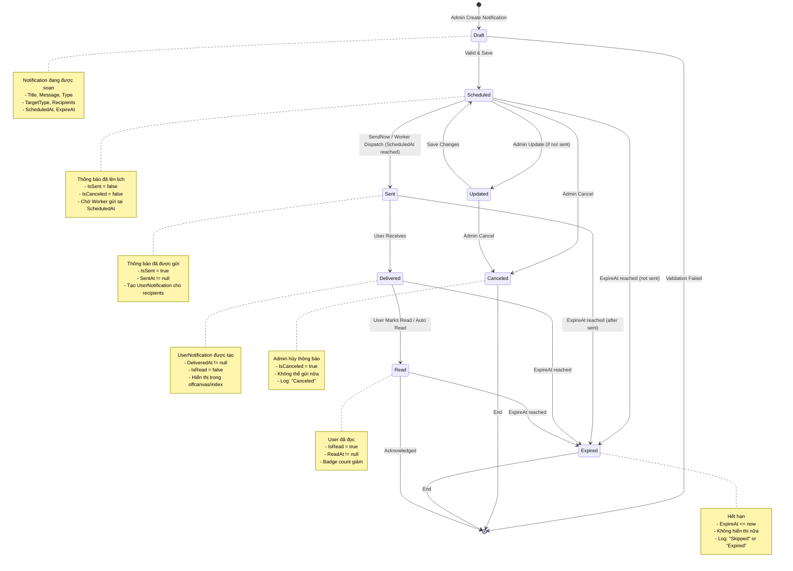
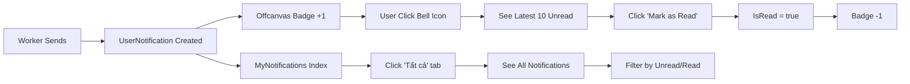
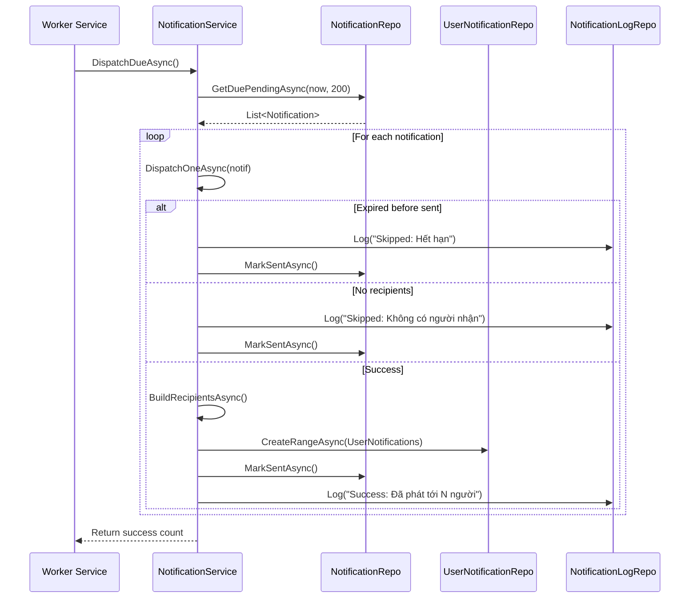

# Notification State Chart

## 📋 Tổng quan
Sơ đồ trạng thái này mô tả vòng đời của một **Notification** từ khi được tạo đến khi được gửi, hết hạn, hoặc bị hủy. Hệ thống hỗ trợ cả Admin (tạo và quản lý) và User (nhận và đọc thông báo).

---

## 🔄 State Chart Diagram



---

## 📊 State Descriptions

### 1️⃣ **Draft** (Nháp)
- **Mô tả**: Notification đang được tạo bởi Admin
- **Properties**:
  - `Title`, `Message`, `Type` (General/Order/Promotion/System)
  - `TargetType` (All/SingleUser/ByRole/ByCondition)
  - `ScheduledAt`, `ExpireAt` (optional)
  - `CreatedBy` (Admin ID)

- **Transitions**:
  - ✅ **→ Scheduled**: Validation thành công, lưu vào DB
  - ❌ **→ [End]**: Validation thất bại (title trống, message quá dài, etc.)

### 2️⃣ **Scheduled** (Đã lên lịch)
- **Mô tả**: Notification đã được lưu, chờ gửi tại `ScheduledAt`
- **Properties**:
  - `IsSent = false`
  - `IsCanceled = false`
  - `SentAt = null`

- **Transitions**:
  - 📤 **→ Sent**: 
    - Admin click "Send Now" (`SendNowAsync()`)
    - Worker tự động gửi khi `ScheduledAt <= now` (`DispatchDueAsync()`)
  - ❌ **→ Canceled**: Admin hủy thông báo (`CancelAsync()`)
  - ⏰ **→ Expired**: Hết hạn trước khi gửi (`ExpireAt <= now`)
  - ✏️ **→ Updated**: Admin chỉnh sửa thông báo (`UpdateAsync()`)

### 3️⃣ **Updated** (Đang cập nhật)
- **Mô tả**: Admin đang chỉnh sửa thông báo chưa gửi
- **Constraints**: Chỉ có thể update nếu `IsSent = false` và `IsCanceled = false`

- **Transitions**:
  - ✅ **→ Scheduled**: Lưu thay đổi thành công
  - ❌ **→ Canceled**: Admin hủy trong lúc edit

### 4️⃣ **Sent** (Đã gửi)
- **Mô tả**: Notification đã được Worker/Admin gửi đi
- **Properties**:
  - `IsSent = true`
  - `SentAt = DateTime.UtcNow`
  - Tạo `UserNotification` records cho các recipients

- **Actions**:
  - Gọi `BuildRecipientsAsync()` để lấy danh sách người nhận
  - Tạo `UserNotification` cho mỗi recipient với:
    ```csharp
    {
        NotificationId, UserId,
        IsRead = false,
        DeliveredAt = now
    }
    ```
  - Log với `Result = "Success"` và `Details = "Đã phát tới N người nhận"`

- **Transitions**:
  - 📨 **→ Delivered**: UserNotification được tạo thành công
  - ⏰ **→ Expired**: Hết hạn sau khi gửi

### 5️⃣ **Delivered** (Đã giao)
- **Mô tả**: UserNotification đã được tạo, user có thể xem trong UI
- **Properties**:
  - `DeliveredAt != null`
  - `IsRead = false`
  - `ReadAt = null`

- **UI Display**:
  - Hiển thị trong **Offcanvas** (top 10 unread)
  - Hiển thị trong **MyNotifications/Index** (full list với pagination)
  - Badge counter tăng

- **Transitions**:
  - 👁️ **→ Read**: User click "Mark as Read" (`MarkReadAsync()`)
  - ⏰ **→ Expired**: Hết hạn (`ExpireAt <= now`)

### 6️⃣ **Read** (Đã đọc)
- **Mô tả**: User đã đọc thông báo
- **Properties**:
  - `IsRead = true`
  - `ReadAt = DateTime.UtcNow`

- **Actions**:
  - Badge counter giảm
  - Cập nhật UI (move to "Đã đọc" tab)

- **Transitions**:
  - ⏰ **→ Expired**: Hết hạn
  - ✅ **→ [End]**: Acknowledged (user đã biết)

### 7️⃣ **Canceled** (Đã hủy)
- **Mô tả**: Admin hủy thông báo trước khi gửi
- **Properties**:
  - `IsCanceled = true`

- **Constraints**: Chỉ có thể hủy nếu `IsSent = false`

- **Actions**:
  - Log với `Result = "Canceled"`, `Details = "Thông báo bị hủy bởi admin"`

- **Transitions**:
  - ⛔ **→ [End]**: Kết thúc vòng đời

### 8️⃣ **Expired** (Hết hạn)
- **Mô tả**: Thông báo hết hạn (`ExpireAt <= now`)
- **Scenarios**:
  - **Before Sent**: Hết hạn trước khi gửi → Log "Skipped"
  - **After Sent**: Hết hạn sau khi gửi → Không hiển thị nữa

- **Actions**:
  - Không hiển thị trong UI (filter out bởi `ExpireAt`)
  - Log với `Result = "Skipped"`, `Details = "Hết hạn trước khi gửi"`

- **Transitions**:
  - ⛔ **→ [End]**: Kết thúc vòng đời

---

## 🎯 Transitions Matrix

| From State | Event | To State | Conditions | Actions |
|-----------|-------|----------|-----------|---------|
| **Draft** | Save | **Scheduled** | Validation OK | Create Notification record |
| **Draft** | Validation Failed | **[End]** | Invalid input | Return error message |
| **Scheduled** | Worker Dispatch | **Sent** | `ScheduledAt <= now` | Create UserNotifications |
| **Scheduled** | Admin SendNow | **Sent** | Admin click | Dispatch immediately |
| **Scheduled** | Admin Cancel | **Canceled** | `IsSent = false` | Set `IsCanceled = true` |
| **Scheduled** | Admin Update | **Updated** | `IsSent = false` | Open edit form |
| **Scheduled** | Expire | **Expired** | `ExpireAt <= now` | Log "Skipped" |
| **Updated** | Save | **Scheduled** | Valid changes | Update record |
| **Updated** | Cancel | **Canceled** | Admin cancel | Set `IsCanceled = true` |
| **Sent** | Create UserNotif | **Delivered** | Recipients found | Create records |
| **Sent** | Expire | **Expired** | `ExpireAt <= now` | Hide from UI |
| **Delivered** | User MarkRead | **Read** | User action | Set `IsRead = true` |
| **Delivered** | Expire | **Expired** | `ExpireAt <= now` | Hide from UI |
| **Read** | Expire | **Expired** | `ExpireAt <= now` | Archive |
| **Read** | Acknowledged | **[End]** | User aware | Complete lifecycle |
| **Canceled** | - | **[End]** | Final state | - |
| **Expired** | - | **[End]** | Final state | - |

---

## 🔧 Key Methods & Responsibilities

### **NotificationService** (Admin & Worker)
| Method | Responsibility | State Transition |
|--------|---------------|------------------|
| `CreateAsync()` | Tạo notification mới | Draft → Scheduled |
| `UpdateAsync()` | Cập nhật notification chưa gửi | Scheduled → Updated → Scheduled |
| `DeleteAsync()` | Xóa notification chưa gửi | Scheduled → [End] |
| `CancelAsync()` | Hủy notification | Scheduled → Canceled |
| `SendNowAsync()` | Gửi ngay lập tức | Scheduled → Sent |
| `DispatchDueAsync()` | Worker gửi các notification đến hạn | Scheduled → Sent |
| `DispatchOneAsync()` | Logic gửi 1 notification | Scheduled → Sent/Expired |
| `BuildRecipientsAsync()` | Xác định danh sách người nhận | Used in Sent state |

### **UserNotificationService** (User)
| Method | Responsibility | State Transition |
|--------|---------------|------------------|
| `GetMyNotificationsAsync()` | Lấy danh sách thông báo của user | Display Delivered/Read |
| `GetUnreadCountAsync()` | Đếm số thông báo chưa đọc | Badge counter |
| `MarkReadAsync()` | Đánh dấu đã đọc | Delivered → Read |
| `MarkAllReadAsync()` | Đánh dấu tất cả đã đọc | Delivered → Read (multiple) |
| `GetUserNotificationByIdAsync()` | Lấy chi tiết 1 thông báo | View detail |

---

## 🧪 Edge Cases & Error Handling

### 1. **Validation Errors** (Draft → [End])
```csharp
- Title rỗng/quá 200 ký tự
- Message rỗng/quá 1000 ký tự
- Title bị duplicate
- Type không hợp lệ (phải là General/Order/Promotion/System)
- TargetType không hợp lệ (phải là All/SingleUser/ByRole/ByCondition)
- ScheduledAt < now (quá khứ)
- ExpireAt <= ScheduledAt
```

### 2. **Cannot Update/Cancel** (Scheduled → Error)
```csharp
- IsSent = true → "Không thể chỉnh sửa/hủy thông báo đã gửi"
- IsCanceled = true → "Không thể chỉnh sửa thông báo đã hủy"
```

### 3. **No Recipients** (Sent → Expired with Log)
```csharp
- TargetType = "ByRole" nhưng không có user nào có role đó
- TargetType = "SingleUser" nhưng user không tồn tại
→ Log "Skipped: Không có người nhận"
```

### 4. **Expired Before Sent** (Scheduled → Expired)
```csharp
- Worker chạy nhưng ExpireAt đã qua
→ Log "Skipped: Hết hạn trước khi gửi"
→ Vẫn mark IsSent = true để không dispatch lại
```

### 5. **User Unauthorized** (Delivered → Error)
```csharp
- User cố đánh dấu đọc thông báo của người khác
→ Return "Không có quyền"
```

---

## 📈 Logging Strategy

### **NotificationLog** tracks:
| Field | Purpose |
|-------|---------|
| `NotificationId` | Link to Notification |
| `SentTo` | Description of recipients (All/Email/RoleName) |
| `Result` | Success/Failed/Canceled/Skipped |
| `Details` | Error message or success count |
| `SentAt` | Timestamp |

### **Log Events**:
- ✅ **Success**: "Đã phát tới N người nhận"
- ❌ **Failed**: "Lỗi khi xử lý: [exception message]"
- 🚫 **Canceled**: "Thông báo bị hủy bởi admin"
- ⏭️ **Skipped**: "Không có người nhận" / "Hết hạn trước khi gửi"

---

## 🎨 UI Flow (User Perspective)



---

## 📝 Summary

### **States**:
1. **Draft** → Tạo mới
2. **Scheduled** → Chờ gửi
3. **Updated** → Đang sửa
4. **Sent** → Đã gửi
5. **Delivered** → Đã giao đến user
6. **Read** → User đã đọc
7. **Canceled** → Admin hủy
8. **Expired** → Hết hạn

### **Key Properties**:
- `IsSent` (bool) - Đã gửi chưa
- `IsCanceled` (bool) - Đã hủy chưa
- `SentAt` (DateTime?) - Thời điểm gửi
- `ScheduledAt` (DateTime) - Thời điểm lên lịch
- `ExpireAt` (DateTime?) - Thời điểm hết hạn

### **User Properties** (UserNotification):
- `IsRead` (bool) - Đã đọc chưa
- `ReadAt` (DateTime?) - Thời điểm đọc
- `DeliveredAt` (DateTime?) - Thời điểm giao

### **Final States**:
- **[End]** - Kết thúc vòng đời
- **Canceled** - Bị hủy bởi admin
- **Expired** - Hết hạn (không hiển thị nữa)
- **Read** - User đã đọc và acknowledge

---

## 🚀 Worker Process Flow



---

## 🎯 Design Principles

1. **Immutability**: Notification đã gửi (`IsSent = true`) không thể sửa/xóa
2. **Atomic Operations**: Gửi thông báo + tạo UserNotification + log trong 1 transaction
3. **Idempotency**: Không gửi lại thông báo đã gửi (check `IsSent`)
4. **Graceful Degradation**: No recipients → Log "Skipped" instead of error
5. **Audit Trail**: Mọi thao tác đều được log vào `NotificationLog`

---

**Created by**: AI Assistant  
**Date**: 2025-11-05  
**Project**: ASP_LorKingDom_PRN222
