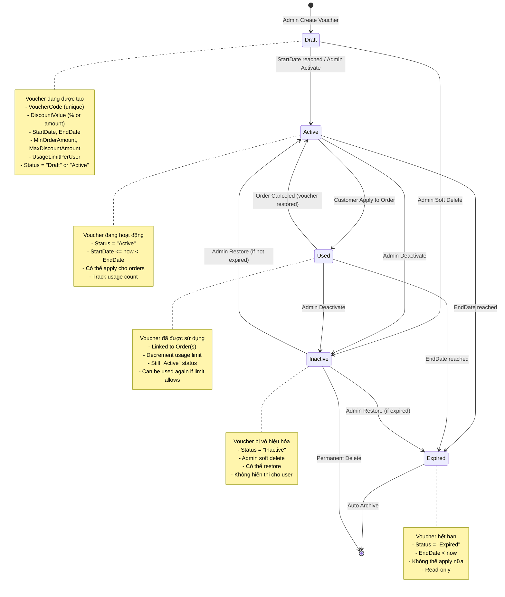
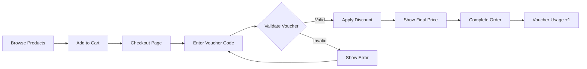
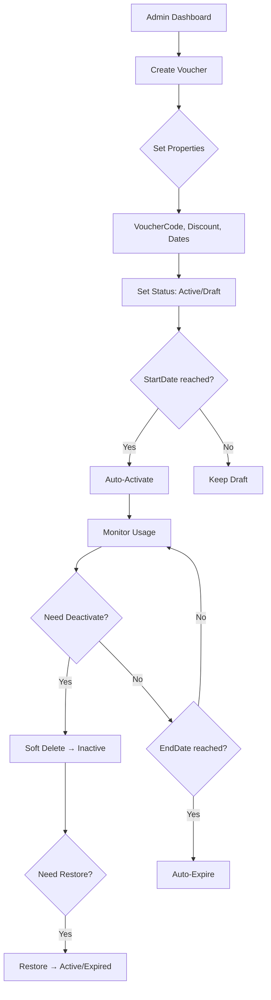

# Voucher State Chart

## 📋 Tổng quan
Sơ đồ trạng thái này mô tả vòng đời của một **Voucher** (mã giảm giá) từ khi được tạo, kích hoạt, sử dụng, đến khi hết hạn hoặc bị vô hiệu hóa. Voucher có thể là phần trăm giảm giá hoặc giảm giá cố định, áp dụng cho đơn hàng với các điều kiện cụ thể.

---

## 🔄 State Chart Diagram



---

## 📊 State Descriptions

### 1️⃣ **Draft** (Nháp)
- **Mô tả**: Voucher mới được tạo, chưa kích hoạt
- **Properties**:
  - `VoucherCode` (string, unique) - Mã voucher
  - `VoucherTypeId` (int) - Loại voucher (Percentage/FixedAmount)
  - `DiscountValue` (decimal) - Giá trị giảm giá
  - `MaxDiscountAmount` (decimal?) - Giảm tối đa (cho % discount)
  - `MinOrderAmount` (decimal?) - Giá trị đơn hàng tối thiểu
  - `UsageLimitPerUser` (int?) - Số lần sử dụng/user
  - `IsStackable` (bool) - Có thể stack với voucher khác không
  - `StartDate`, `EndDate` (DateTime)
  - `Status = "Draft"` (có thể set ngay "Active")

- **Transitions**:
  - ✅ **→ Active**: 
    - Khi `StartDate <= now` (auto-activation)
    - Admin manually activate
  - ❌ **→ Inactive**: Admin soft delete

- **Validations**:
  - `VoucherCode` phải unique
  - `StartDate < EndDate`
  - `DiscountValue > 0`

### 2️⃣ **Active** (Hoạt động)
- **Mô tả**: Voucher đang hoạt động, có thể apply cho orders
- **Properties**:
  - `Status = "Active"`
  - `StartDate <= now < EndDate`

- **Business Rules**:
  ```csharp
  // Validate trước khi apply
  - Voucher must be Active
  - now >= StartDate && now < EndDate
  - orderAmount >= MinOrderAmount (if set)
  - User usage count < UsageLimitPerUser (if set)
  - Check IsStackable if multiple vouchers
  ```

- **Transitions**:
  - 🎫 **→ Used**: Customer apply voucher to order
  - ⏰ **→ Expired**: `EndDate <= now` (auto-expire)
  - ❌ **→ Inactive**: Admin deactivate

### 3️⃣ **Used** (Đã sử dụng)
- **Mô tả**: Voucher đã được apply vào order (state logic, không phải DB status)
- **Note**: Đây là **logical state**, không phải DB status field. Voucher vẫn có `Status = "Active"` nhưng được track qua `Order.VoucherId` relationship.

- **Tracking**:
  ```csharp
  // Count usage per user
  var usageCount = await _orderRepo.CountByVoucherAndUserAsync(voucherId, userId);
  if (voucher.UsageLimitPerUser.HasValue && 
      usageCount >= voucher.UsageLimitPerUser.Value)
  {
      throw new InvalidOperationException("Đã hết lượt sử dụng voucher");
  }
  ```

- **Transitions**:
  - ↩️ **→ Active**: Order canceled (voucher restored)
  - ⏰ **→ Expired**: `EndDate <= now`
  - ❌ **→ Inactive**: Admin force deactivate

### 4️⃣ **Expired** (Hết hạn)
- **Mô tả**: Voucher hết hạn tự động
- **Properties**:
  - `Status = "Expired"` (hoặc check `EndDate < now`)
  - Read-only, không thể apply nữa

- **Auto-Expire Logic**:
  ```csharp
  // Worker service hoặc validation check
  if (voucher.EndDate < DateTime.Now && voucher.Status == "Active")
  {
      voucher.Status = "Expired";
      await _repo.UpdateAsync(voucher);
  }
  ```

- **Transitions**:
  - ⛔ **→ [End]**: Archive, không thể restore

### 5️⃣ **Inactive** (Vô hiệu hóa)
- **Mô tả**: Admin soft delete voucher
- **Properties**:
  - `Status = "Inactive"`
  - Không hiển thị cho user
  - Có thể restore

- **Transitions**:
  - ✅ **→ Active**: Admin restore (nếu `EndDate > now`)
  - ⏰ **→ Expired**: Admin restore (nếu `EndDate <= now`)
  - ❌ **→ [End]**: Permanent delete (hard delete)

---

## 📐 Transitions Matrix

| From State | Event | To State | Conditions | Actions |
|-----------|-------|----------|-----------|---------|
| **[Start]** | Create | **Draft** | Valid input | Create Voucher record |
| **Draft** | StartDate reached | **Active** | `StartDate <= now` | Auto-activate |
| **Draft** | Admin Activate | **Active** | Manual action | Set Status = "Active" |
| **Draft** | Admin Soft Delete | **Inactive** | Manual action | Set Status = "Inactive" |
| **Active** | Customer Apply | **Used** | Validation passed | Link to Order |
| **Active** | EndDate reached | **Expired** | `EndDate <= now` | Set Status = "Expired" |
| **Active** | Admin Deactivate | **Inactive** | Manual action | Set Status = "Inactive" |
| **Used** | Order Canceled | **Active** | Order status change | Decrement usage count |
| **Used** | EndDate reached | **Expired** | `EndDate <= now` | Set Status = "Expired" |
| **Used** | Admin Deactivate | **Inactive** | Manual action | Set Status = "Inactive" |
| **Expired** | - | **[End]** | Final state | Archive |
| **Inactive** | Admin Restore | **Active** | `EndDate > now` | Set Status = "Active" |
| **Inactive** | Admin Restore | **Expired** | `EndDate <= now` | Set Status = "Expired" |
| **Inactive** | Admin Delete | **[End]** | Hard delete | Remove from DB |

---

## 🔧 Key Methods & Responsibilities

### **VoucherService**
| Method | Responsibility | State Transition |
|--------|---------------|------------------|
| `CreateAsync()` | Tạo voucher mới | [Start] → Draft/Active |
| `UpdateAsync()` | Cập nhật voucher | (same state) |
| `SoftDeleteAsync()` | Vô hiệu hóa voucher | Active → Inactive |
| `RestoreAsync()` | Khôi phục voucher | Inactive → Active/Expired |
| `ApplyVoucherAsync()` | Validate và apply voucher | Active → Used (logical) |
| `ValidateForApplyAsync()` | Kiểm tra điều kiện apply | Check Active state |

### **VoucherValidator**
| Method | Responsibility | Validates |
|--------|---------------|----------|
| `ValidateForApplyAsync()` | Validate before applying | Status, Dates, Limits, Amount |

### **Key Validation Rules**
```csharp
public async Task<(bool, string, Voucher?)> ValidateForApplyAsync(
    string code, int accountId, decimal orderAmount)
{
    var voucher = await _repo.GetByCodeAsync(code);
    
    // 1. Voucher exists
    if (voucher == null)
        return (false, "Voucher không tồn tại", null);
    
    // 2. Status check
    if (voucher.Status != "Active")
        return (false, "Voucher không hoạt động", null);
    
    // 3. Date range check
    var now = DateTime.Now;
    if (now < voucher.StartDate)
        return (false, "Voucher chưa có hiệu lực", null);
    if (now >= voucher.EndDate)
        return (false, "Voucher đã hết hạn", null);
    
    // 4. Min order amount check
    if (voucher.MinOrderAmount.HasValue && 
        orderAmount < voucher.MinOrderAmount.Value)
        return (false, $"Đơn hàng tối thiểu {voucher.MinOrderAmount:C}", null);
    
    // 5. Usage limit check
    if (voucher.UsageLimitPerUser.HasValue)
    {
        var usageCount = await _orderRepo.CountByVoucherAndUserAsync(
            voucher.VoucherId, accountId);
        if (usageCount >= voucher.UsageLimitPerUser.Value)
            return (false, "Đã hết lượt sử dụng", null);
    }
    
    return (true, "Voucher hợp lệ", voucher);
}
```

---

## 🧮 Discount Calculation Logic

### Percentage Discount
```csharp
if (voucher.VoucherType.VoucherTypeName == "Percentage")
{
    var discount = orderAmount * (voucher.DiscountValue / 100);
    
    // Apply max discount cap
    if (voucher.MaxDiscountAmount.HasValue && 
        discount > voucher.MaxDiscountAmount.Value)
    {
        discount = voucher.MaxDiscountAmount.Value;
    }
    
    return discount;
}
```

### Fixed Amount Discount
```csharp
if (voucher.VoucherType.VoucherTypeName == "FixedAmount")
{
    var discount = voucher.DiscountValue;
    
    // Cannot exceed order amount
    if (discount > orderAmount)
        discount = orderAmount;
    
    return discount;
}
```

### Stacking Logic
```csharp
public async Task<decimal> CalculateTotalDiscountAsync(
    List<Voucher> vouchers, decimal orderAmount)
{
    // Check stackable
    if (vouchers.Count > 1 && vouchers.Any(v => !v.IsStackable))
        throw new InvalidOperationException("Không thể stack vouchers này");
    
    decimal totalDiscount = 0;
    
    foreach (var voucher in vouchers)
    {
        var discount = CalculateDiscount(voucher, orderAmount - totalDiscount);
        totalDiscount += discount;
    }
    
    // Total discount cannot exceed order amount
    if (totalDiscount > orderAmount)
        totalDiscount = orderAmount;
    
    return totalDiscount;
}
```

---

## 🧪 Edge Cases & Error Handling

### 1. **Expired Voucher Applied**
```csharp
// Check at apply time
if (voucher.EndDate < DateTime.Now)
{
    // Auto-update status
    voucher.Status = "Expired";
    await _repo.UpdateAsync(voucher);
    throw new InvalidOperationException("Voucher đã hết hạn");
}
```

### 2. **Usage Limit Exceeded**
```csharp
var usageCount = await _orderRepo.CountByVoucherAndUserAsync(voucherId, userId);
if (voucher.UsageLimitPerUser.HasValue && 
    usageCount >= voucher.UsageLimitPerUser.Value)
{
    return (false, "Bạn đã hết lượt sử dụng voucher này", null);
}
```

### 3. **Min Order Amount Not Met**
```csharp
if (voucher.MinOrderAmount.HasValue && 
    orderAmount < voucher.MinOrderAmount.Value)
{
    return (false, 
        $"Đơn hàng tối thiểu {voucher.MinOrderAmount:C} để sử dụng voucher này", 
        null);
}
```

### 4. **Stacking Violation**
```csharp
if (existingVouchers.Any() && 
    (existingVouchers.Any(v => !v.IsStackable) || !newVoucher.IsStackable))
{
    throw new InvalidOperationException(
        "Voucher này không thể stack với vouchers khác");
}
```

### 5. **Order Cancellation - Restore Voucher**
```csharp
// When order is canceled
public async Task RestoreVoucherUsageAsync(int orderId)
{
    var order = await _orderRepo.GetByIdAsync(orderId);
    if (order?.VoucherId.HasValue == true)
    {
        // Voucher usage is tracked via Order.VoucherId
        // No action needed - usage count will auto-decrease on query
        await _logService.LogAsync($"Voucher {order.VoucherId} restored from canceled order {orderId}");
    }
}
```

### 6. **Duplicate Voucher Code**
```csharp
if (await _repo.VoucherCodeExistsAsync(dto.VoucherCode))
    throw new ArgumentException("Voucher code already exists.");
```

---

## 📈 Usage Tracking

### Count Usage Per User
```csharp
public async Task<int> GetUsageCountAsync(int voucherId, int userId)
{
    return await _context.Orders
        .Where(o => o.VoucherId == voucherId && 
                    o.AccountId == userId &&
                    o.StatusId >= StatusIds.Confirmed) // Only confirmed orders
        .CountAsync();
}
```

### Get Available Vouchers for User
```csharp
public async Task<List<VoucherDto>> GetAvailableForUserAsync(int userId, decimal orderAmount)
{
    var now = DateTime.Now;
    var allVouchers = await _repo.GetAllAsync();
    
    var available = new List<VoucherDto>();
    
    foreach (var voucher in allVouchers)
    {
        // Status check
        if (voucher.Status != "Active") continue;
        
        // Date check
        if (now < voucher.StartDate || now >= voucher.EndDate) continue;
        
        // Min order check
        if (voucher.MinOrderAmount.HasValue && 
            orderAmount < voucher.MinOrderAmount.Value) continue;
        
        // Usage limit check
        if (voucher.UsageLimitPerUser.HasValue)
        {
            var usageCount = await GetUsageCountAsync(voucher.VoucherId, userId);
            if (usageCount >= voucher.UsageLimitPerUser.Value) continue;
        }
        
        available.Add(MapToDto(voucher));
    }
    
    return available;
}
```

---

## 🎨 UI Flow (Customer Perspective)



### Admin Flow


---

## 📊 Worker Service (Auto-Expiration)

```csharp
public class VoucherWorkerService : BackgroundService
{
    protected override async Task ExecuteAsync(CancellationToken stoppingToken)
    {
        while (!stoppingToken.IsCancellationRequested)
        {
            try
            {
                await ExpireVouchersAsync();
                await Task.Delay(TimeSpan.FromHours(1), stoppingToken);
            }
            catch (Exception ex)
            {
                _logger.LogError(ex, "Error in VoucherWorkerService");
            }
        }
    }
    
    private async Task ExpireVouchersAsync()
    {
        var now = DateTime.Now;
        var activeVouchers = await _repo.GetByStatusAsync("Active");
        
        foreach (var voucher in activeVouchers)
        {
            if (voucher.EndDate <= now)
            {
                voucher.Status = "Expired";
                voucher.UpdatedAt = now;
                await _repo.UpdateAsync(voucher);
                
                _logger.LogInformation(
                    $"Voucher {voucher.VoucherCode} auto-expired at {now}");
            }
        }
    }
}
```

---

## 🔍 Database Schema

```sql
CREATE TABLE Vouchers (
    VoucherId INT PRIMARY KEY IDENTITY,
    VoucherTypeId INT NOT NULL,
    CreateBy INT,
    VoucherCode NVARCHAR(50) UNIQUE NOT NULL,
    DiscountValue DECIMAL(18, 2) NOT NULL,
    MaxDiscountAmount DECIMAL(18, 2),
    MinOrderAmount DECIMAL(18, 2),
    UsageLimitPerUser INT,
    IsStackable BIT NOT NULL DEFAULT 0,
    StartDate DATETIME NOT NULL,
    EndDate DATETIME NOT NULL,
    Status NVARCHAR(20) NOT NULL DEFAULT 'Active', -- Active/Inactive/Expired
    CreatedAt DATETIME NOT NULL DEFAULT GETDATE(),
    UpdatedAt DATETIME,
    
    CONSTRAINT FK_Vouchers_VoucherType FOREIGN KEY (VoucherTypeId) 
        REFERENCES VoucherTypes(VoucherTypeId),
    CONSTRAINT FK_Vouchers_Account FOREIGN KEY (CreateBy) 
        REFERENCES Accounts(AccountId)
);

-- Index for performance
CREATE INDEX IX_Vouchers_Status ON Vouchers(Status);
CREATE INDEX IX_Vouchers_Dates ON Vouchers(StartDate, EndDate);
CREATE INDEX IX_Vouchers_Code ON Vouchers(VoucherCode);
```

---

## 🎯 Business Rules Summary

1. **Unique Voucher Code**: Mỗi voucher phải có code unique
2. **Date Validation**: `StartDate < EndDate`
3. **Positive Discount**: `DiscountValue > 0`
4. **Auto-Activation**: Voucher tự động active khi `StartDate <= now`
5. **Auto-Expiration**: Voucher tự động expire khi `EndDate <= now`
6. **Usage Limit**: Track số lần sử dụng per user
7. **Min Order Amount**: Order phải đạt giá trị tối thiểu
8. **Stacking Logic**: Vouchers phải có `IsStackable = true` để stack
9. **Soft Delete**: Inactive vouchers có thể restore
10. **Hard Delete**: Permanent delete chỉ khi admin confirm

---

## 📝 Summary

### **States**:
1. **Draft** → Voucher mới tạo
2. **Active** → Đang hoạt động
3. **Used** → Đã sử dụng (logical state)
4. **Expired** → Hết hạn
5. **Inactive** → Vô hiệu hóa (soft delete)

### **Key Properties**:
- `Status` (string) - Active/Inactive/Expired
- `VoucherCode` (string, unique) - Mã voucher
- `DiscountValue` (decimal) - Giá trị giảm giá
- `StartDate`, `EndDate` (DateTime) - Thời gian hiệu lực
- `UsageLimitPerUser` (int?) - Giới hạn sử dụng
- `IsStackable` (bool) - Có thể stack không

### **Relationships**:
- `VoucherType` (1:N) - Loại voucher (Percentage/FixedAmount)
- `Account` (CreateBy) - Admin tạo voucher
- `Orders` (N:1) - Orders sử dụng voucher

### **Validation Points**:
- At Creation: Code unique, Date valid, Value positive
- At Apply: Status Active, Dates valid, Amount sufficient, Limit not exceeded
- At Auto-Expire: EndDate reached

---

**Created by**: AI Assistant  
**Date**: 2025-11-05  
**Project**: ASP_LorKingDom_PRN222
