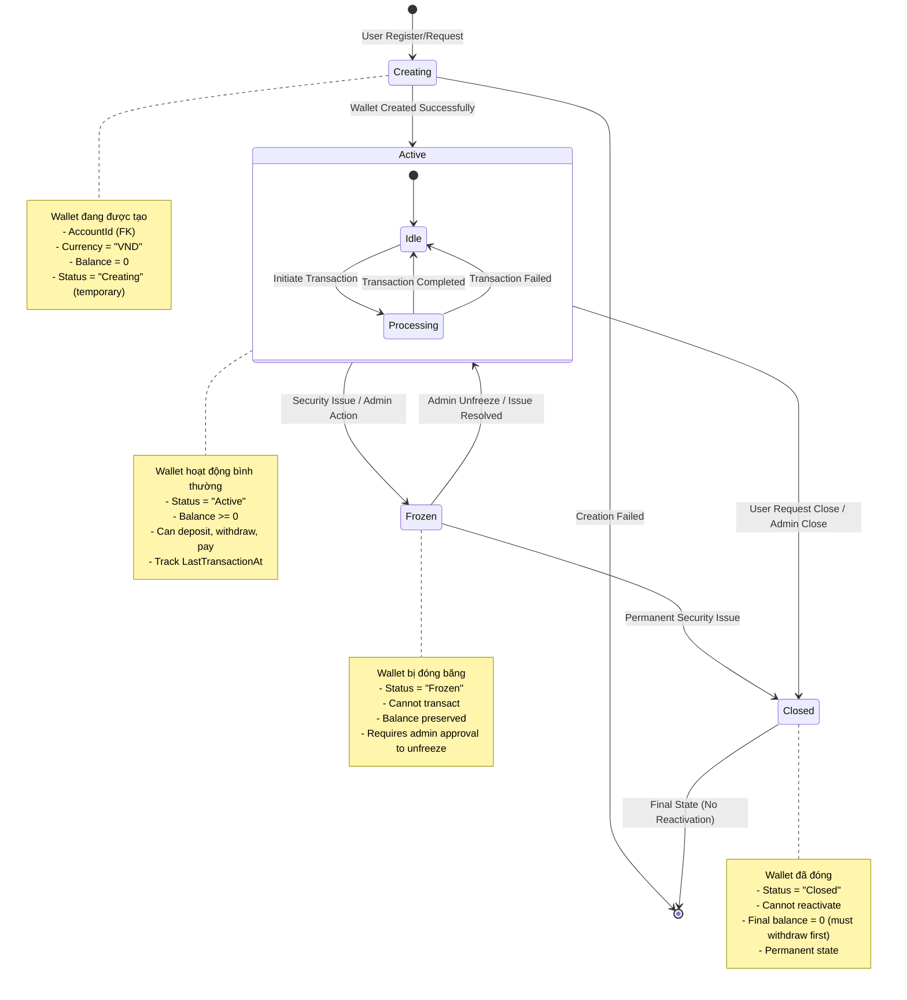
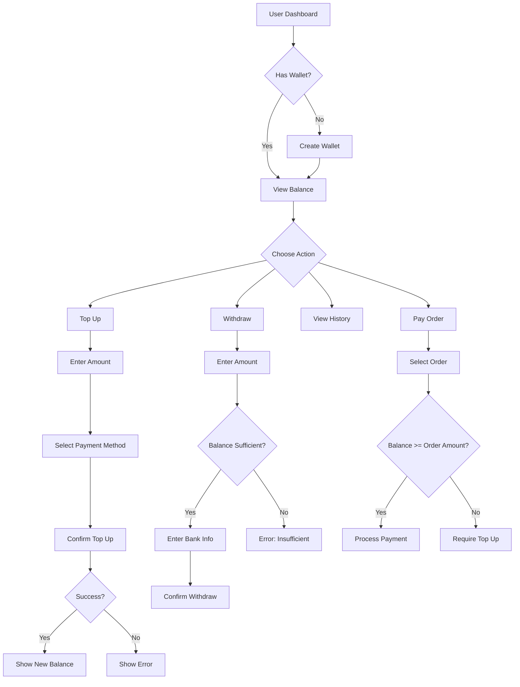

# Wallet State Chart

## 📋 Tổng quan
Sơ đồ trạng thái này mô tả vòng đời của **Wallet** (ví điện tử) trong hệ thống, từ khi được tạo, sử dụng, đến khi bị đóng băng hoặc đóng hoàn toàn. Wallet cho phép user lưu trữ số dư, thực hiện giao dịch (nạp tiền, rút tiền, thanh toán orders).

---

## 🔄 State Chart Diagram



---

## 📊 State Descriptions

### 1️⃣ **Creating** (Đang tạo)
- **Mô tả**: Wallet đang được khởi tạo khi user đăng ký hoặc request tạo ví
- **Properties**:
  - `AccountId` (int, FK) - Liên kết với Account
  - `Currency` (string) - "VND" (default)
  - `Balance` (decimal) - 0 (initial)
  - `Status` (string) - "Creating" (temporary)

- **Transitions**:
  - ✅ **→ Active**: Tạo wallet thành công
  - ❌ **→ [End]**: Validation failed (duplicate wallet, invalid account)

- **Business Rules**:
  - Mỗi Account chỉ có **1 Wallet**
  - Balance khởi tạo = 0
  - Currency mặc định = "VND"

### 2️⃣ **Active** (Hoạt động)
- **Mô tả**: Wallet đang hoạt động, có thể thực hiện transactions
- **Properties**:
  - `Status = "Active"`
  - `Balance >= 0` (không được âm)
  - `LastTransactionAt` (DateTime?) - Timestamp giao dịch cuối

- **Sub-States**:
  - **Idle**: Không có transaction đang xử lý
  - **Processing**: Đang xử lý transaction (transient state)

- **Allowed Operations**:
  - ✅ **TopUp** (Nạp tiền): Deposit money into wallet
  - ✅ **Withdraw** (Rút tiền): Withdraw money from wallet
  - ✅ **Payment** (Thanh toán): Pay for orders
  - ✅ **Refund** (Hoàn tiền): Receive refunds from canceled orders
  - ✅ **View Balance**: Read-only operation

- **Transitions**:
  - 🔒 **→ Frozen**: 
    - Security issue detected (fraud, suspicious activity)
    - Admin manually freeze
    - Multiple failed transaction attempts
  - ❌ **→ Closed**: 
    - User request to close wallet (balance = 0)
    - Admin close wallet (violation)

- **Invariants**:
  ```csharp
  // Balance never goes negative
  invariant: wallet.Balance >= 0
  
  // LastTransactionAt updated on every transaction
  on_transaction: wallet.LastTransactionAt = DateTime.Now
  ```

### 3️⃣ **Frozen** (Đóng băng)
- **Mô tả**: Wallet bị khóa tạm thời do vấn đề bảo mật hoặc admin action
- **Properties**:
  - `Status = "Frozen"`
  - `Balance` (preserved, read-only)
  - Cannot perform any transactions

- **Reasons for Freezing**:
  - Suspicious activity detected
  - Multiple failed login attempts
  - Security investigation ongoing
  - Admin manually freeze

- **Transitions**:
  - ✅ **→ Active**: 
    - Admin unfreeze after investigation
    - Security issue resolved
  - ❌ **→ Closed**: 
    - Permanent security violation
    - Fraud confirmed

- **Operations**:
  - ❌ TopUp - Blocked
  - ❌ Withdraw - Blocked
  - ❌ Payment - Blocked
  - ✅ View Balance - Allowed (read-only)

### 4️⃣ **Closed** (Đã đóng)
- **Mô tả**: Wallet đã đóng vĩnh viễn, không thể reactivate
- **Properties**:
  - `Status = "Closed"`
  - `Balance = 0` (must withdraw all before closing)

- **Preconditions for Closing**:
  - Balance must be 0
  - No pending transactions
  - User confirmation required

- **Transitions**:
  - ⛔ **→ [End]**: Final state, không thể quay lại

- **Operations**:
  - ❌ All transactions - Blocked
  - ✅ View history - Allowed (read-only)

---

## 📐 Transitions Matrix

| From State | Event | To State | Conditions | Actions |
|-----------|-------|----------|-----------|---------|
| **[Start]** | User Register | **Creating** | Valid account | Initialize wallet |
| **Creating** | Validation Success | **Active** | No duplicate wallet | Set Status = "Active" |
| **Creating** | Validation Failed | **[End]** | Duplicate/Invalid | Rollback creation |
| **Active** | Security Issue | **Frozen** | Fraud detected | Set Status = "Frozen", Log reason |
| **Active** | Admin Freeze | **Frozen** | Manual action | Set Status = "Frozen" |
| **Active** | User Close Request | **Closed** | Balance = 0 | Set Status = "Closed" |
| **Active** | Admin Close | **Closed** | Policy violation | Set Status = "Closed" |
| **Active** | Transaction Start | **Processing** | Balance sufficient | Lock wallet |
| **Processing** | Transaction Success | **Idle** | - | Update balance, release lock |
| **Processing** | Transaction Failed | **Idle** | - | Rollback, release lock |
| **Frozen** | Admin Unfreeze | **Active** | Investigation complete | Set Status = "Active" |
| **Frozen** | Permanent Ban | **Closed** | Fraud confirmed | Set Status = "Closed" |
| **Closed** | - | **[End]** | Final state | Archive wallet |

---

## 🔧 Key Methods & Responsibilities

### **WalletService**
| Method | Responsibility | State Transition |
|--------|---------------|------------------|
| `CreateAsync()` | Tạo wallet mới | Creating → Active |
| `GetByAccountIdAsync()` | Lấy thông tin wallet | (read-only) |
| `TopUpAsync()` | Nạp tiền vào wallet | Active → Processing → Active |
| `WithdrawAsync()` | Rút tiền từ wallet | Active → Processing → Active |
| `PayForOrderAsync()` | Thanh toán order | Active → Processing → Active |
| `RefundToWalletAsync()` | Hoàn tiền về wallet | Active → Processing → Active |
| `FreezeAsync()` | Đóng băng wallet | Active → Frozen |
| `UnfreezeAsync()` | Mở khóa wallet | Frozen → Active |
| `CloseAsync()` | Đóng wallet vĩnh viễn | Active/Frozen → Closed |

### **Key Validation Rules**

#### Create Wallet
```csharp
public async Task<int> CreateAsync(int accountId)
{
    // 1. Check duplicate
    var exists = await _walletRepo.ExistsByAccountIdAsync(accountId);
    if (exists)
        throw new InvalidOperationException("Bạn đã có ví rồi!");
    
    // 2. Validate account exists
    var account = await _accountRepo.GetByIdAsync(accountId);
    if (account == null)
        throw new InvalidOperationException("Tài khoản không tồn tại");
    
    // 3. Create wallet
    var wallet = new Wallet
    {
        AccountId = accountId,
        Currency = "VND",
        Balance = 0,
        Status = "Active",
        CreatedAt = DateTime.Now
    };
    
    await _walletRepo.AddAsync(wallet);
    return wallet.WalletId;
}
```

#### Top Up
```csharp
public async Task<TopUpResultDto> TopUpAsync(int accountId, TopUpWalletDto dto)
{
    // 1. Validate amount
    if (dto.Amount <= 0)
        return new TopUpResultDto { Success = false, Message = "Số tiền phải > 0" };
    
    if (dto.Amount > 100_000_000)
        return new TopUpResultDto { Success = false, Message = "Số tiền tối đa 100M VND" };
    
    // 2. Get wallet
    var wallet = await _walletRepo.GetByAccountIdAsync(accountId);
    if (wallet == null)
        return new TopUpResultDto { Success = false, Message = "Không tìm thấy ví" };
    
    // 3. Check status
    if (wallet.Status != "Active")
        return new TopUpResultDto { Success = false, Message = "Ví đang bị khóa" };
    
    // 4. Create transaction (see WalletTransaction state chart)
    using var transaction = await _context.Database.BeginTransactionAsync();
    try
    {
        var balanceBefore = wallet.Balance;
        var balanceAfter = balanceBefore + dto.Amount;
        
        // Create WalletTransaction record
        var txn = new WalletTransaction
        {
            WalletId = wallet.WalletId,
            AccountId = accountId,
            TxnType = "TopUp",
            Direction = "CR", // Credit
            Amount = dto.Amount,
            BalanceBefore = balanceBefore,
            BalanceAfter = balanceAfter,
            Method = dto.Method ?? "Manual",
            Status = "Completed",
            IdempotencyKey = Guid.NewGuid().ToString(),
            CreatedAt = DateTime.Now,
            CompletedAt = DateTime.Now
        };
        await _transactionRepo.AddAsync(txn);
        
        // Update wallet
        wallet.Balance = balanceAfter;
        wallet.LastTransactionAt = DateTime.Now;
        wallet.UpdatedAt = DateTime.Now;
        await _walletRepo.UpdateAsync(wallet);
        
        await transaction.CommitAsync();
        
        return new TopUpResultDto
        {
            Success = true,
            Message = "Nạp tiền thành công",
            NewBalance = balanceAfter,
            TransactionId = txn.WalletTransactionId
        };
    }
    catch (Exception ex)
    {
        await transaction.RollbackAsync();
        return new TopUpResultDto
        {
            Success = false,
            Message = $"Lỗi: {ex.Message}"
        };
    }
}
```

#### Withdraw
```csharp
public async Task<WithdrawResultDto> WithdrawAsync(int accountId, WithdrawDto dto)
{
    // 1. Validate amount
    if (dto.Amount <= 0)
        return new WithdrawResultDto { Success = false, Message = "Số tiền phải > 0" };
    
    // 2. Get wallet
    var wallet = await _walletRepo.GetByAccountIdAsync(accountId);
    if (wallet == null)
        return new WithdrawResultDto { Success = false, Message = "Không tìm thấy ví" };
    
    // 3. Check status
    if (wallet.Status != "Active")
        return new WithdrawResultDto { Success = false, Message = "Ví đang bị khóa" };
    
    // 4. Check sufficient balance
    if (wallet.Balance < dto.Amount)
        return new WithdrawResultDto { Success = false, Message = "Số dư không đủ" };
    
    // 5. Create transaction
    using var transaction = await _context.Database.BeginTransactionAsync();
    try
    {
        var balanceBefore = wallet.Balance;
        var balanceAfter = balanceBefore - dto.Amount;
        
        var txn = new WalletTransaction
        {
            WalletId = wallet.WalletId,
            AccountId = accountId,
            TxnType = "Withdraw",
            Direction = "DR", // Debit
            Amount = dto.Amount,
            BalanceBefore = balanceBefore,
            BalanceAfter = balanceAfter,
            Method = dto.Method ?? "BankTransfer",
            Status = "Completed",
            IdempotencyKey = Guid.NewGuid().ToString(),
            CreatedAt = DateTime.Now,
            CompletedAt = DateTime.Now
        };
        await _transactionRepo.AddAsync(txn);
        
        wallet.Balance = balanceAfter;
        wallet.LastTransactionAt = DateTime.Now;
        wallet.UpdatedAt = DateTime.Now;
        await _walletRepo.UpdateAsync(wallet);
        
        await transaction.CommitAsync();
        
        return new WithdrawResultDto
        {
            Success = true,
            Message = "Rút tiền thành công",
            NewBalance = balanceAfter,
            TransactionId = txn.WalletTransactionId
        };
    }
    catch (Exception ex)
    {
        await transaction.RollbackAsync();
        return new WithdrawResultDto { Success = false, Message = $"Lỗi: {ex.Message}" };
    }
}
```

#### Freeze/Unfreeze
```csharp
public async Task FreezeAsync(int walletId, string reason, int adminId)
{
    var wallet = await _walletRepo.GetByIdAsync(walletId);
    if (wallet == null)
        throw new KeyNotFoundException("Không tìm thấy ví");
    
    if (wallet.Status != "Active")
        throw new InvalidOperationException("Ví không ở trạng thái Active");
    
    wallet.Status = "Frozen";
    wallet.UpdatedAt = DateTime.Now;
    await _walletRepo.UpdateAsync(wallet);
    
    // Log freeze action
    await _logService.LogAsync(new SecurityLog
    {
        WalletId = walletId,
        Action = "Freeze",
        Reason = reason,
        PerformedBy = adminId,
        PerformedAt = DateTime.Now
    });
}

public async Task UnfreezeAsync(int walletId, int adminId)
{
    var wallet = await _walletRepo.GetByIdAsync(walletId);
    if (wallet == null)
        throw new KeyNotFoundException("Không tìm thấy ví");
    
    if (wallet.Status != "Frozen")
        throw new InvalidOperationException("Ví không ở trạng thái Frozen");
    
    wallet.Status = "Active";
    wallet.UpdatedAt = DateTime.Now;
    await _walletRepo.UpdateAsync(wallet);
    
    // Log unfreeze action
    await _logService.LogAsync(new SecurityLog
    {
        WalletId = walletId,
        Action = "Unfreeze",
        PerformedBy = adminId,
        PerformedAt = DateTime.Now
    });
}
```

#### Close Wallet
```csharp
public async Task CloseAsync(int walletId, int requestedBy)
{
    var wallet = await _walletRepo.GetByIdAsync(walletId);
    if (wallet == null)
        throw new KeyNotFoundException("Không tìm thấy ví");
    
    if (wallet.Status == "Closed")
        throw new InvalidOperationException("Ví đã đóng trước đó");
    
    // Must withdraw all balance first
    if (wallet.Balance > 0)
        throw new InvalidOperationException("Phải rút hết số dư trước khi đóng ví");
    
    // Check no pending transactions
    var pendingTxns = await _transactionRepo.GetPendingByWalletIdAsync(walletId);
    if (pendingTxns.Any())
        throw new InvalidOperationException("Còn giao dịch đang xử lý");
    
    wallet.Status = "Closed";
    wallet.UpdatedAt = DateTime.Now;
    await _walletRepo.UpdateAsync(wallet);
    
    // Log close action
    await _logService.LogAsync(new SecurityLog
    {
        WalletId = walletId,
        Action = "Close",
        PerformedBy = requestedBy,
        PerformedAt = DateTime.Now
    });
}
```

---

## 🧪 Edge Cases & Error Handling

### 1. **Duplicate Wallet Creation**
```csharp
var exists = await _walletRepo.ExistsByAccountIdAsync(accountId);
if (exists)
    throw new InvalidOperationException("Mỗi tài khoản chỉ có 1 ví");
```

### 2. **Insufficient Balance**
```csharp
if (wallet.Balance < amount)
    throw new InvalidOperationException($"Số dư không đủ. Hiện tại: {wallet.Balance:C}");
```

### 3. **Frozen Wallet Transaction**
```csharp
if (wallet.Status == "Frozen")
    throw new InvalidOperationException("Ví đang bị đóng băng, vui lòng liên hệ admin");
```

### 4. **Closed Wallet Access**
```csharp
if (wallet.Status == "Closed")
    throw new InvalidOperationException("Ví đã đóng, không thể thực hiện giao dịch");
```

### 5. **Negative Balance Prevention**
```csharp
// INVARIANT: Balance >= 0
if (wallet.Balance - amount < 0)
    throw new InvalidOperationException("Giao dịch bị từ chối: Balance không thể âm");
```

### 6. **Concurrent Transaction Handling**
```csharp
// Use row-level locking
var wallet = await _context.Wallets
    .Where(w => w.WalletId == walletId)
    .WithLock(LockMode.Exclusive) // Pessimistic locking
    .FirstOrDefaultAsync();

// Or optimistic locking with versioning
wallet.Version++; // Add Version column for concurrency control
```

### 7. **Idempotency for TopUp/Withdraw**
```csharp
// Check if transaction already processed
var existing = await _transactionRepo.GetByIdempotencyKeyAsync(dto.IdempotencyKey);
if (existing != null)
{
    return new TopUpResultDto
    {
        Success = true,
        Message = "Giao dịch đã được xử lý trước đó",
        TransactionId = existing.WalletTransactionId,
        NewBalance = wallet.Balance
    };
}
```

---

## 🎨 UI Flow (User Perspective)



---

## 📊 Balance Management

### Balance Calculation
```csharp
// Balance is always calculated from transactions
public async Task<decimal> CalculateBalanceAsync(int walletId)
{
    var transactions = await _transactionRepo.GetByWalletIdAsync(walletId);
    
    decimal balance = 0;
    foreach (var txn in transactions.OrderBy(t => t.CreatedAt))
    {
        if (txn.Direction == "CR") // Credit (tăng)
            balance += txn.Amount;
        else if (txn.Direction == "DR") // Debit (giảm)
            balance -= txn.Amount;
    }
    
    return balance;
}

// Verify wallet balance integrity
public async Task<bool> VerifyBalanceIntegrityAsync(int walletId)
{
    var wallet = await _walletRepo.GetByIdAsync(walletId);
    var calculatedBalance = await CalculateBalanceAsync(walletId);
    
    if (wallet.Balance != calculatedBalance)
    {
        await _logService.LogErrorAsync(
            $"Balance mismatch for Wallet {walletId}: " +
            $"DB={wallet.Balance}, Calculated={calculatedBalance}");
        return false;
    }
    
    return true;
}
```

### Balance Limits
```csharp
public class WalletConfig
{
    public const decimal MIN_BALANCE = 0; // Cannot go negative
    public const decimal MAX_BALANCE = 1_000_000_000; // 1 billion VND
    public const decimal MIN_TOPUP = 10_000; // 10K VND
    public const decimal MAX_TOPUP = 100_000_000; // 100M VND per transaction
    public const decimal MIN_WITHDRAW = 50_000; // 50K VND
    public const decimal MAX_WITHDRAW = 50_000_000; // 50M VND per transaction
}
```

---

## 📈 Wallet Analytics

### Wallet Statistics
```csharp
public async Task<WalletStatsDto> GetStatsAsync(int walletId)
{
    var transactions = await _transactionRepo.GetByWalletIdAsync(walletId);
    
    return new WalletStatsDto
    {
        TotalTopUp = transactions
            .Where(t => t.TxnType == "TopUp" && t.Status == "Completed")
            .Sum(t => t.Amount),
        
        TotalWithdraw = transactions
            .Where(t => t.TxnType == "Withdraw" && t.Status == "Completed")
            .Sum(t => t.Amount),
        
        TotalPayment = transactions
            .Where(t => t.TxnType == "Payment" && t.Status == "Completed")
            .Sum(t => t.Amount),
        
        TotalRefund = transactions
            .Where(t => t.TxnType == "Refund" && t.Status == "Completed")
            .Sum(t => t.Amount),
        
        TransactionCount = transactions.Count,
        LastTransactionAt = transactions.Max(t => t.CreatedAt)
    };
}
```

---

## 🔍 Database Schema

```sql
CREATE TABLE Wallets (
    WalletId INT PRIMARY KEY IDENTITY,
    AccountId INT NOT NULL UNIQUE,
    Currency NVARCHAR(10) NOT NULL DEFAULT 'VND',
    Balance DECIMAL(18, 2) NOT NULL DEFAULT 0 CHECK (Balance >= 0),
    Status NVARCHAR(20) NOT NULL DEFAULT 'Active', -- Active/Frozen/Closed
    LastTransactionAt DATETIME,
    CreatedAt DATETIME NOT NULL DEFAULT GETDATE(),
    UpdatedAt DATETIME,
    
    CONSTRAINT FK_Wallets_Account FOREIGN KEY (AccountId) 
        REFERENCES Accounts(AccountId) ON DELETE CASCADE,
    CONSTRAINT CK_Wallet_Status CHECK (Status IN ('Active', 'Frozen', 'Closed'))
);

-- Indexes
CREATE INDEX IX_Wallets_Status ON Wallets(Status);
CREATE INDEX IX_Wallets_AccountId ON Wallets(AccountId);
```

---

## 🎯 Business Rules Summary

1. **One Wallet Per Account**: Mỗi Account chỉ có 1 Wallet
2. **Non-Negative Balance**: Balance >= 0 (CRITICAL INVARIANT)
3. **Active Only Transactions**: Chỉ Wallet Active mới giao dịch được
4. **Frozen Read-Only**: Wallet Frozen chỉ xem được, không giao dịch
5. **Close Requires Zero Balance**: Phải rút hết tiền trước khi đóng ví
6. **No Reactivation After Close**: Wallet Closed không thể mở lại
7. **Atomic Transactions**: Mọi giao dịch phải atomic (all-or-nothing)
8. **Idempotency**: Transactions phải idempotent (prevent duplicate)
9. **Audit Trail**: Log mọi state changes
10. **Balance Integrity**: Định kỳ verify balance = sum(transactions)

---

## 📝 Summary

### **States**:
1. **Creating** → Đang tạo ví
2. **Active** → Hoạt động bình thường (Idle/Processing)
3. **Frozen** → Đóng băng tạm thời
4. **Closed** → Đóng vĩnh viễn

### **Key Properties**:
- `Status` (string) - Active/Frozen/Closed
- `Balance` (decimal) - Số dư hiện tại (>= 0)
- `Currency` (string) - "VND"
- `LastTransactionAt` (DateTime?) - Giao dịch cuối

### **Operations**:
- TopUp (Nạp tiền)
- Withdraw (Rút tiền)
- Payment (Thanh toán order)
- Refund (Hoàn tiền)
- Freeze/Unfreeze (Admin)
- Close (User/Admin)

### **Invariants**:
- Balance >= 0 (NEVER negative)
- One Wallet per Account
- Closed wallets cannot reactivate

---

**Created by**: AI Assistant  
**Date**: 2025-11-05  
**Project**: ASP_LorKingDom_PRN222
