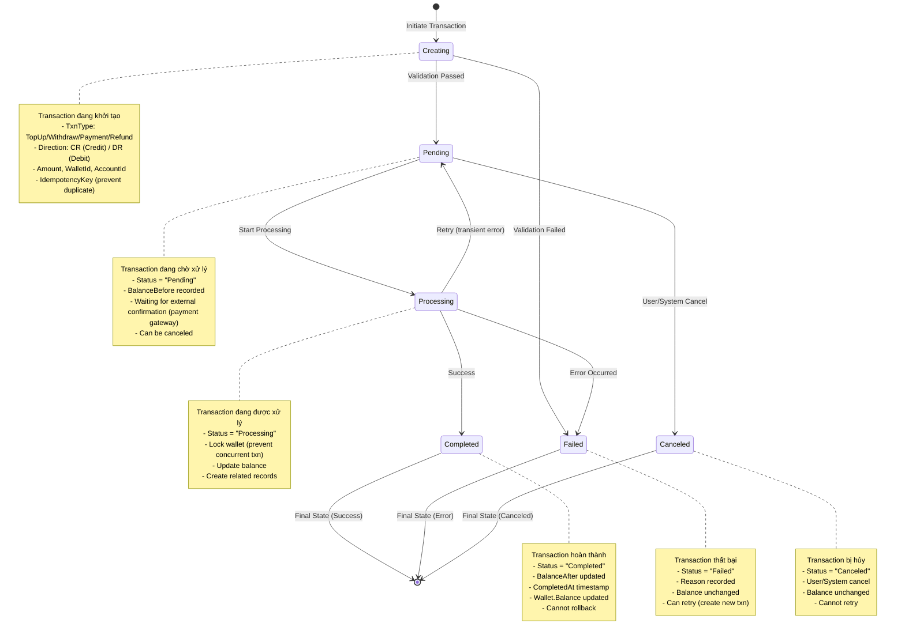

# Wallet Transaction State Chart

## 📋 Tổng quan
Sơ đồ trạng thái này mô tả vòng đời của một **WalletTransaction** (giao dịch ví), từ khi được khởi tạo, xử lý, đến khi hoàn thành hoặc thất bại. Mỗi transaction track balance changes và đảm bảo tính toàn vẹn của dữ liệu với idempotency.

---

## 🔄 State Chart Diagram



---

## 📊 State Descriptions

### 1️⃣ **Creating** (Đang tạo)
- **Mô tả**: Transaction đang được khởi tạo và validate
- **Properties**:
  - `WalletId` (int, FK)
  - `AccountId` (int, FK)
  - `TxnType` (string): TopUp, Withdraw, Payment, Refund
  - `Direction` (string): CR (Credit - tăng), DR (Debit - giảm)
  - `Amount` (decimal, > 0)
  - `Method` (string?): Manual, BankTransfer, VNPay, etc.
  - `IdempotencyKey` (string, unique): Prevent duplicate transactions

- **Validations**:
  ```csharp
  // 1. Amount validation
  if (dto.Amount <= 0)
      throw new ArgumentException("Amount must be positive");
  
  // 2. Wallet exists and active
  var wallet = await _walletRepo.GetByIdAsync(dto.WalletId);
  if (wallet == null || wallet.Status != "Active")
      throw new InvalidOperationException("Wallet not available");
  
  // 3. Sufficient balance (for DR transactions)
  if (dto.Direction == "DR" && wallet.Balance < dto.Amount)
      throw new InvalidOperationException("Insufficient balance");
  
  // 4. Idempotency check
  var existing = await _transactionRepo.GetByIdempotencyKeyAsync(dto.IdempotencyKey);
  if (existing != null)
      return existing; // Return existing transaction
  ```

- **Transitions**:
  - ✅ **→ Pending**: Validation passed, awaiting processing
  - ❌ **→ Failed**: Validation failed

### 2️⃣ **Pending** (Chờ xử lý)
- **Mô tả**: Transaction đã validate, đang chờ xử lý hoặc confirmation
- **Properties**:
  - `Status = "Pending"`
  - `BalanceBefore` (decimal) - Snapshot of balance before txn
  - `CreatedAt` (DateTime)

- **Use Cases**:
  - **TopUp via Payment Gateway**: Chờ payment gateway confirm
  - **Withdraw**: Chờ admin approve (nếu có rule)
  - **Payment**: Chờ order processing

- **Transitions**:
  - 🔄 **→ Processing**: Start processing (lock wallet)
  - ❌ **→ Canceled**: User cancel / Timeout

### 3️⃣ **Processing** (Đang xử lý)
- **Mô tả**: Transaction đang được xử lý, wallet bị lock
- **Properties**:
  - `Status = "Processing"`
  - Wallet locked (pessimistic/optimistic locking)

- **Operations**:
  ```csharp
  // 1. Lock wallet (prevent concurrent modifications)
  var wallet = await _context.Wallets
      .Where(w => w.WalletId == walletId)
      .WithLock(LockMode.Exclusive)
      .FirstOrDefaultAsync();
  
  // 2. Calculate new balance
  decimal newBalance = (txn.Direction == "CR") 
      ? wallet.Balance + txn.Amount
      : wallet.Balance - txn.Amount;
  
  // 3. Update transaction
  txn.BalanceAfter = newBalance;
  txn.Status = "Completed";
  txn.CompletedAt = DateTime.Now;
  
  // 4. Update wallet
  wallet.Balance = newBalance;
  wallet.LastTransactionAt = DateTime.Now;
  
  // 5. Commit transaction
  await _context.SaveChangesAsync();
  ```

- **Transitions**:
  - ✅ **→ Completed**: Success
  - ❌ **→ Failed**: Error occurred
  - 🔄 **→ Pending**: Retry on transient error (optional)

### 4️⃣ **Completed** (Hoàn thành)
- **Mô tả**: Transaction thành công, balance đã update
- **Properties**:
  - `Status = "Completed"`
  - `BalanceAfter` (decimal) - New balance
  - `CompletedAt` (DateTime)

- **Invariants**:
  ```csharp
  // Balance integrity check
  if (txn.Direction == "CR")
      assert: txn.BalanceAfter == txn.BalanceBefore + txn.Amount
  else if (txn.Direction == "DR")
      assert: txn.BalanceAfter == txn.BalanceBefore - txn.Amount
  ```

- **Transitions**:
  - ⛔ **→ [End]**: Final state, cannot be reversed (immutable)

### 5️⃣ **Failed** (Thất bại)
- **Mô tả**: Transaction failed, balance không thay đổi
- **Properties**:
  - `Status = "Failed"`
  - `Reason` (string?) - Error message
  - Balance unchanged

- **Common Failure Reasons**:
  - Insufficient balance
  - Wallet frozen/closed
  - Payment gateway error
  - Database deadlock
  - Network timeout

- **Transitions**:
  - ⛔ **→ [End]**: Final state, có thể retry (create new txn)

### 6️⃣ **Canceled** (Đã hủy)
- **Mô tả**: Transaction bị hủy bởi user/system
- **Properties**:
  - `Status = "Canceled"`
  - `Reason` (string?) - Cancellation reason

- **Cancellation Scenarios**:
  - User cancel pending topup
  - Payment timeout
  - Order canceled before payment

- **Transitions**:
  - ⛔ **→ [End]**: Final state, không thể retry

---

## 📐 Transitions Matrix

| From State | Event | To State | Conditions | Actions |
|-----------|-------|----------|-----------|---------|
| **[Start]** | Initiate | **Creating** | User action | Validate input |
| **Creating** | Validation Success | **Pending** | All checks passed | Create record with Status="Pending" |
| **Creating** | Validation Failed | **Failed** | Invalid data | Return error |
| **Pending** | Start Processing | **Processing** | Lock acquired | Lock wallet, set Status="Processing" |
| **Pending** | Cancel | **Canceled** | User/System cancel | Set Status="Canceled" |
| **Processing** | Success | **Completed** | No errors | Update balance, set CompletedAt |
| **Processing** | Error | **Failed** | Exception occurred | Rollback, log error |
| **Processing** | Transient Error | **Pending** | Retryable error | Release lock, retry later |
| **Completed** | - | **[End]** | Final state | Immutable |
| **Failed** | - | **[End]** | Final state | Can create new txn |
| **Canceled** | - | **[End]** | Final state | Cannot retry |

---

## 🔧 Key Methods & Responsibilities

### **WalletTransactionService**
| Method | Responsibility | State Transition |
|--------|---------------|------------------|
| `CreateTransactionAsync()` | Khởi tạo transaction | Creating → Pending |
| `ProcessTransactionAsync()` | Xử lý transaction | Pending → Processing → Completed/Failed |
| `CancelTransactionAsync()` | Hủy transaction | Pending → Canceled |
| `GetByIdAsync()` | Lấy thông tin transaction | (read-only) |
| `GetByWalletIdAsync()` | Lấy history của wallet | (read-only) |
| `VerifyIntegrityAsync()` | Kiểm tra tính toàn vẹn | (read-only) |

### **Transaction Types**

#### 1. TopUp (Nạp tiền)
```csharp
public async Task<WalletTransaction> CreateTopUpAsync(TopUpDto dto)
{
    var wallet = await _walletRepo.GetByAccountIdAsync(dto.AccountId);
    ValidateWallet(wallet);
    
    using var transaction = await _context.Database.BeginTransactionAsync();
    try
    {
        var txn = new WalletTransaction
        {
            WalletId = wallet.WalletId,
            AccountId = dto.AccountId,
            TxnType = "TopUp",
            Direction = "CR", // Credit
            Amount = dto.Amount,
            BalanceBefore = wallet.Balance,
            BalanceAfter = wallet.Balance + dto.Amount,
            Method = dto.Method,
            Status = "Completed", // Direct complete for manual topup
            IdempotencyKey = dto.IdempotencyKey ?? Guid.NewGuid().ToString(),
            CreatedAt = DateTime.Now,
            CompletedAt = DateTime.Now
        };
        
        await _transactionRepo.AddAsync(txn);
        
        wallet.Balance += dto.Amount;
        wallet.LastTransactionAt = DateTime.Now;
        await _walletRepo.UpdateAsync(wallet);
        
        await transaction.CommitAsync();
        return txn;
    }
    catch (Exception ex)
    {
        await transaction.RollbackAsync();
        throw;
    }
}
```

#### 2. Withdraw (Rút tiền)
```csharp
public async Task<WalletTransaction> CreateWithdrawAsync(WithdrawDto dto)
{
    var wallet = await _walletRepo.GetByAccountIdAsync(dto.AccountId);
    ValidateWallet(wallet);
    
    if (wallet.Balance < dto.Amount)
        throw new InvalidOperationException("Insufficient balance");
    
    using var transaction = await _context.Database.BeginTransactionAsync();
    try
    {
        var txn = new WalletTransaction
        {
            WalletId = wallet.WalletId,
            AccountId = dto.AccountId,
            TxnType = "Withdraw",
            Direction = "DR", // Debit
            Amount = dto.Amount,
            BalanceBefore = wallet.Balance,
            BalanceAfter = wallet.Balance - dto.Amount,
            Method = dto.Method,
            Status = "Completed",
            IdempotencyKey = dto.IdempotencyKey ?? Guid.NewGuid().ToString(),
            CreatedAt = DateTime.Now,
            CompletedAt = DateTime.Now
        };
        
        await _transactionRepo.AddAsync(txn);
        
        wallet.Balance -= dto.Amount;
        wallet.LastTransactionAt = DateTime.Now;
        await _walletRepo.UpdateAsync(wallet);
        
        await transaction.CommitAsync();
        return txn;
    }
    catch (Exception ex)
    {
        await transaction.RollbackAsync();
        throw;
    }
}
```

#### 3. Payment (Thanh toán order)
```csharp
public async Task<WalletTransaction> CreatePaymentAsync(PaymentDto dto)
{
    var wallet = await _walletRepo.GetByAccountIdAsync(dto.AccountId);
    ValidateWallet(wallet);
    
    if (wallet.Balance < dto.OrderAmount)
        throw new InvalidOperationException("Insufficient balance");
    
    using var transaction = await _context.Database.BeginTransactionAsync();
    try
    {
        var txn = new WalletTransaction
        {
            WalletId = wallet.WalletId,
            AccountId = dto.AccountId,
            TxnType = "Payment",
            Direction = "DR",
            Amount = dto.OrderAmount,
            BalanceBefore = wallet.Balance,
            BalanceAfter = wallet.Balance - dto.OrderAmount,
            RelatedOrderId = dto.OrderId,
            Method = "Wallet",
            Status = "Completed",
            IdempotencyKey = dto.IdempotencyKey ?? Guid.NewGuid().ToString(),
            CreatedAt = DateTime.Now,
            CompletedAt = DateTime.Now
        };
        
        await _transactionRepo.AddAsync(txn);
        
        wallet.Balance -= dto.OrderAmount;
        wallet.LastTransactionAt = DateTime.Now;
        await _walletRepo.UpdateAsync(wallet);
        
        await transaction.CommitAsync();
        return txn;
    }
    catch (Exception ex)
    {
        await transaction.RollbackAsync();
        throw;
    }
}
```

#### 4. Refund (Hoàn tiền)
```csharp
public async Task<WalletTransaction> CreateRefundAsync(RefundDto dto)
{
    var wallet = await _walletRepo.GetByAccountIdAsync(dto.AccountId);
    ValidateWallet(wallet);
    
    using var transaction = await _context.Database.BeginTransactionAsync();
    try
    {
        var txn = new WalletTransaction
        {
            WalletId = wallet.WalletId,
            AccountId = dto.AccountId,
            TxnType = "Refund",
            Direction = "CR", // Credit back to wallet
            Amount = dto.RefundAmount,
            BalanceBefore = wallet.Balance,
            BalanceAfter = wallet.Balance + dto.RefundAmount,
            RelatedOrderId = dto.OrderId,
            Method = "Wallet",
            Reason = dto.Reason,
            Status = "Completed",
            IdempotencyKey = dto.IdempotencyKey ?? Guid.NewGuid().ToString(),
            CreatedAt = DateTime.Now,
            CompletedAt = DateTime.Now
        };
        
        await _transactionRepo.AddAsync(txn);
        
        wallet.Balance += dto.RefundAmount;
        wallet.LastTransactionAt = DateTime.Now;
        await _walletRepo.UpdateAsync(wallet);
        
        await transaction.CommitAsync();
        return txn;
    }
    catch (Exception ex)
    {
        await transaction.RollbackAsync();
        throw;
    }
}
```

---

## 🧪 Edge Cases & Error Handling

### 1. **Idempotency - Duplicate Transactions**
```csharp
// Check idempotency key before creating
var existing = await _transactionRepo.GetByIdempotencyKeyAsync(dto.IdempotencyKey);
if (existing != null)
{
    // Return existing transaction (already processed)
    return new TransactionResultDto
    {
        Success = true,
        Message = "Transaction already processed",
        TransactionId = existing.WalletTransactionId,
        Status = existing.Status
    };
}
```

### 2. **Concurrent Transactions - Race Condition**
```csharp
// Use pessimistic locking
var wallet = await _context.Wallets
    .Where(w => w.WalletId == walletId)
    .WithLock(LockMode.Exclusive)
    .FirstOrDefaultAsync();

// Or optimistic locking with row version
wallet.RowVersion++; // Increment version, will fail if concurrent update
```

### 3. **Insufficient Balance**
```csharp
if (txn.Direction == "DR" && wallet.Balance < txn.Amount)
{
    var failedTxn = new WalletTransaction
    {
        ...
        Status = "Failed",
        Reason = $"Insufficient balance. Current: {wallet.Balance:C}, Required: {txn.Amount:C}",
        CreatedAt = DateTime.Now
    };
    await _transactionRepo.AddAsync(failedTxn);
    throw new InvalidOperationException("Insufficient balance");
}
```

### 4. **Wallet Not Active**
```csharp
if (wallet.Status != "Active")
{
    throw new InvalidOperationException($"Wallet status is {wallet.Status}, cannot transact");
}
```

### 5. **Negative Balance Prevention**
```csharp
// CRITICAL INVARIANT
if (wallet.Balance - txn.Amount < 0)
{
    throw new InvalidOperationException("Transaction would result in negative balance");
}
```

### 6. **Database Transaction Rollback**
```csharp
using var dbTransaction = await _context.Database.BeginTransactionAsync();
try
{
    // 1. Create WalletTransaction record
    await _transactionRepo.AddAsync(txn);
    
    // 2. Update Wallet balance
    await _walletRepo.UpdateAsync(wallet);
    
    // 3. Commit both changes atomically
    await dbTransaction.CommitAsync();
}
catch (Exception ex)
{
    // Rollback on any error
    await dbTransaction.RollbackAsync();
    
    // Log failed transaction
    await _logService.LogErrorAsync($"Transaction failed: {ex.Message}");
    
    throw;
}
```

### 7. **Retry Logic for Transient Errors**
```csharp
public async Task<WalletTransaction> ProcessWithRetryAsync(long txnId, int maxRetries = 3)
{
    int attempt = 0;
    Exception lastException = null;
    
    while (attempt < maxRetries)
    {
        try
        {
            return await ProcessTransactionAsync(txnId);
        }
        catch (DbUpdateException ex) when (IsTransient(ex))
        {
            attempt++;
            lastException = ex;
            await Task.Delay(TimeSpan.FromSeconds(Math.Pow(2, attempt))); // Exponential backoff
        }
    }
    
    // Max retries exceeded
    throw new InvalidOperationException($"Failed after {maxRetries} attempts", lastException);
}

private bool IsTransient(Exception ex)
{
    // Check if error is transient (deadlock, timeout, etc.)
    return ex.Message.Contains("deadlock") || 
           ex.Message.Contains("timeout");
}
```

---

## 📊 Balance Integrity Verification

```csharp
public async Task<bool> VerifyBalanceIntegrityAsync(int walletId)
{
    var wallet = await _walletRepo.GetByIdAsync(walletId);
    var transactions = await _transactionRepo.GetByWalletIdAsync(walletId);
    
    // Calculate balance from transactions
    decimal calculatedBalance = 0;
    foreach (var txn in transactions.Where(t => t.Status == "Completed").OrderBy(t => t.CreatedAt))
    {
        if (txn.Direction == "CR")
            calculatedBalance += txn.Amount;
        else if (txn.Direction == "DR")
            calculatedBalance -= txn.Amount;
    }
    
    // Compare with wallet balance
    if (Math.Abs(wallet.Balance - calculatedBalance) > 0.01m) // Allow 0.01 VND tolerance
    {
        await _logService.LogErrorAsync(new
        {
            WalletId = walletId,
            WalletBalance = wallet.Balance,
            CalculatedBalance = calculatedBalance,
            Difference = wallet.Balance - calculatedBalance,
            Message = "Balance integrity check failed"
        });
        
        return false;
    }
    
    return true;
}
```

---

## 📈 Transaction Analytics

```csharp
public async Task<TransactionStatsDto> GetStatsAsync(int walletId, DateTime? from = null, DateTime? to = null)
{
    var transactions = await _transactionRepo.GetByWalletIdAsync(walletId, from, to);
    
    return new TransactionStatsDto
    {
        TotalTransactions = transactions.Count,
        CompletedCount = transactions.Count(t => t.Status == "Completed"),
        FailedCount = transactions.Count(t => t.Status == "Failed"),
        CanceledCount = transactions.Count(t => t.Status == "Canceled"),
        
        TotalCredit = transactions
            .Where(t => t.Direction == "CR" && t.Status == "Completed")
            .Sum(t => t.Amount),
        
        TotalDebit = transactions
            .Where(t => t.Direction == "DR" && t.Status == "Completed")
            .Sum(t => t.Amount),
        
        NetChange = transactions
            .Where(t => t.Status == "Completed")
            .Sum(t => t.Direction == "CR" ? t.Amount : -t.Amount),
        
        AverageTransactionAmount = transactions
            .Where(t => t.Status == "Completed")
            .Average(t => t.Amount),
        
        LastTransactionAt = transactions.Max(t => t.CreatedAt)
    };
}
```

---

## 🔍 Database Schema

```sql
CREATE TABLE WalletTransactions (
    WalletTransactionId BIGINT PRIMARY KEY IDENTITY,
    WalletId INT NOT NULL,
    AccountId INT NOT NULL,
    TxnType NVARCHAR(50) NOT NULL, -- TopUp, Withdraw, Payment, Refund
    Direction NVARCHAR(2) NOT NULL CHECK (Direction IN ('CR', 'DR')),
    Amount DECIMAL(18, 2) NOT NULL CHECK (Amount > 0),
    BalanceBefore DECIMAL(18, 2) NOT NULL,
    BalanceAfter DECIMAL(18, 2) NOT NULL,
    RelatedOrderId INT,
    RelatedPaymentHistoryId BIGINT,
    Method NVARCHAR(50),
    ExternalRef NVARCHAR(255), -- Payment gateway reference
    IdempotencyKey NVARCHAR(255) UNIQUE NOT NULL,
    Status NVARCHAR(20) NOT NULL DEFAULT 'Pending', -- Pending/Processing/Completed/Failed/Canceled
    Reason NVARCHAR(500),
    Metadata NVARCHAR(MAX), -- JSON for extra data
    CreatedAt DATETIME NOT NULL DEFAULT GETDATE(),
    CompletedAt DATETIME,
    
    CONSTRAINT FK_WalletTransactions_Wallet FOREIGN KEY (WalletId) 
        REFERENCES Wallets(WalletId),
    CONSTRAINT FK_WalletTransactions_Account FOREIGN KEY (AccountId) 
        REFERENCES Accounts(AccountId),
    CONSTRAINT FK_WalletTransactions_Order FOREIGN KEY (RelatedOrderId) 
        REFERENCES Orders(OrderId),
    CONSTRAINT CK_WalletTransaction_Status CHECK (Status IN ('Pending', 'Processing', 'Completed', 'Failed', 'Canceled'))
);

-- Indexes
CREATE INDEX IX_WalletTransactions_WalletId ON WalletTransactions(WalletId);
CREATE INDEX IX_WalletTransactions_AccountId ON WalletTransactions(AccountId);
CREATE INDEX IX_WalletTransactions_Status ON WalletTransactions(Status);
CREATE INDEX IX_WalletTransactions_IdempotencyKey ON WalletTransactions(IdempotencyKey);
CREATE INDEX IX_WalletTransactions_CreatedAt ON WalletTransactions(CreatedAt DESC);
```

---

## 🎯 Business Rules Summary

1. **Positive Amount**: Amount > 0 always
2. **Idempotency**: IdempotencyKey unique, prevent duplicate
3. **Atomic Operations**: Transaction record + Wallet update must be atomic
4. **Balance Tracking**: BalanceBefore & BalanceAfter must be recorded
5. **Immutable Completed**: Completed transactions cannot be modified
6. **Direction Consistency**: CR = Credit (increase), DR = Debit (decrease)
7. **Status Flow**: Pending → Processing → Completed/Failed/Canceled
8. **Sufficient Balance**: DR transactions require sufficient balance
9. **Wallet Active Only**: Only Active wallets can create transactions
10. **Audit Trail**: All transactions logged with timestamps

---

## 📝 Summary

### **States**:
1. **Creating** → Validation
2. **Pending** → Waiting for processing
3. **Processing** → In progress
4. **Completed** → Success
5. **Failed** → Error
6. **Canceled** → User/System canceled

### **Key Properties**:
- `Status` (string) - Transaction state
- `TxnType` (string) - TopUp/Withdraw/Payment/Refund
- `Direction` (string) - CR/DR
- `Amount` (decimal) - Transaction amount
- `BalanceBefore/After` (decimal) - Balance tracking
- `IdempotencyKey` (string) - Duplicate prevention

### **Invariants**:
- Amount > 0
- BalanceAfter = BalanceBefore ± Amount (based on Direction)
- Wallet.Balance >= 0 (after transaction)
- IdempotencyKey unique
- Completed transactions immutable

---

**Created by**: AI Assistant  
**Date**: 2025-11-05  
**Project**: ASP_LorKingDom_PRN222
