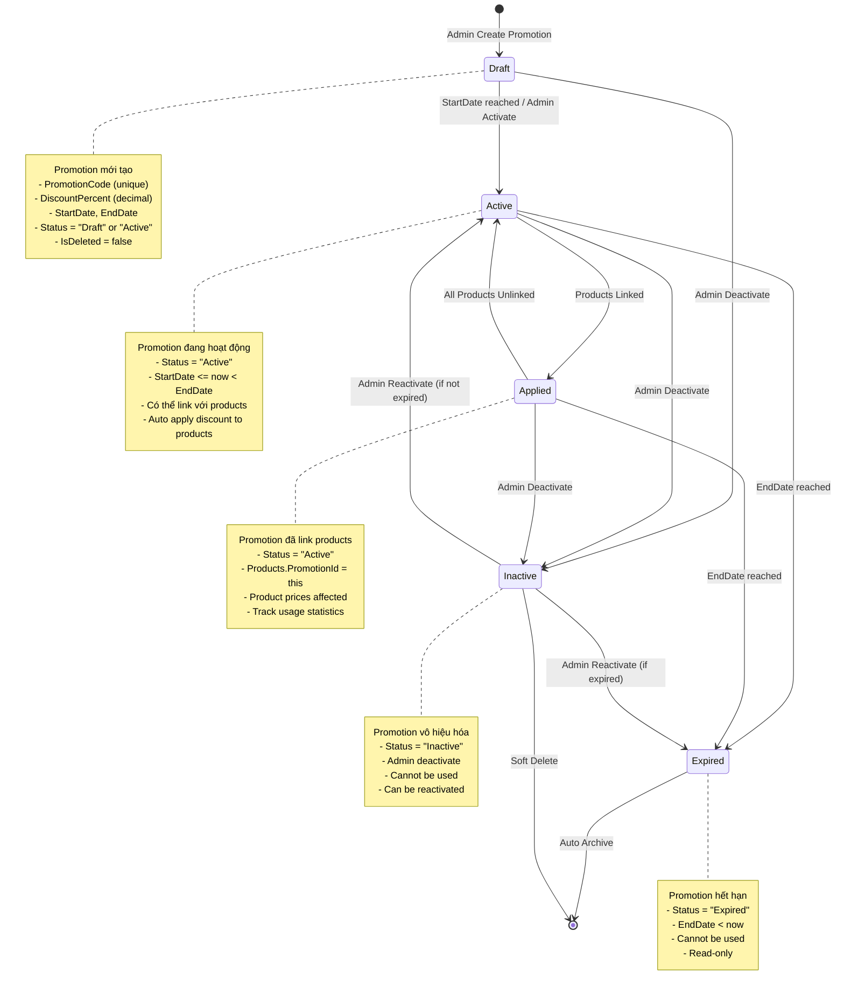

# Promotion State Chart

## 📋 Tổng quan
Sơ đồ trạng thái này mô tả vòng đời của **Promotion** (chương trình khuyến mãi) từ khi được tạo, kích hoạt, áp dụng cho products, đến khi hết hạn hoặc bị vô hiệu hóa. Promotion tự động apply discount cho các products được liên kết.

---

## 🔄 State Chart Diagram



---

## 📊 State Descriptions

### 1️⃣ **Draft** (Nháp)
- **Mô tả**: Promotion mới được tạo, chưa active
- **Properties**:
  - `PromotionCode` (string, unique)
  - `Description` (string?)
  - `DiscountPercent` (decimal?) - % giảm giá
  - `StartDate`, `EndDate` (DateTime)
  - `Status = "Draft"` (hoặc set ngay "Active")
  - `IsDeleted = false`

- **Transitions**:
  - ✅ **→ Active**: `StartDate <= now` hoặc Admin activate
  - ❌ **→ Inactive**: Admin deactivate

### 2️⃣ **Active** (Hoạt động)
- **Mô tả**: Promotion đang hoạt động, có thể link products
- **Properties**:
  - `Status = "Active"`
  - `StartDate <= now < EndDate`

- **Business Rules**:
  ```csharp
  // Auto-apply discount to linked products
  foreach (var product in promotion.Products)
  {
      product.DiscountPercent = promotion.DiscountPercent;
      product.EffectivePrice = product.Price * (1 - promotion.DiscountPercent / 100);
  }
  ```

- **Transitions**:
  - 🔗 **→ Applied**: Link products to promotion
  - ⏰ **→ Expired**: `EndDate <= now`
  - ❌ **→ Inactive**: Admin deactivate

### 3️⃣ **Applied** (Đã áp dụng)
- **Mô tả**: Promotion đã link với products (logical state)
- **Note**: Không phải DB status, là trạng thái logic khi `Products.Count > 0`

- **Tracking**:
  ```csharp
  var linkedProducts = await _productRepo.GetByPromotionIdAsync(promotionId);
  bool isApplied = linkedProducts.Any();
  ```

- **Transitions**:
  - ↩️ **→ Active**: Unlink all products
  - ⏰ **→ Expired**: `EndDate <= now`
  - ❌ **→ Inactive**: Admin deactivate

### 4️⃣ **Expired** (Hết hạn)
- **Mô tả**: Promotion hết hạn
- **Properties**:
  - `Status = "Expired"` (hoặc check `EndDate < now`)
  - Cannot be used

- **Auto-Expire Logic**:
  ```csharp
  // Worker service
  if (promotion.EndDate < DateTime.Now && promotion.Status == "Active")
  {
      promotion.Status = "Expired";
      await _repo.UpdateAsync(promotion);
      
      // Remove discount from products
      foreach (var product in promotion.Products)
      {
          product.PromotionId = null;
          product.DiscountPercent = null;
      }
  }
  ```

- **Transitions**:
  - ⛔ **→ [End]**: Archive

### 5️⃣ **Inactive** (Vô hiệu hóa)
- **Mô tả**: Admin deactivate promotion
- **Properties**:
  - `Status = "Inactive"`
  - Cannot be used
  - Can be reactivated

- **Transitions**:
  - ✅ **→ Active**: Admin reactivate (if `EndDate > now`)
  - ⏰ **→ Expired**: Admin reactivate (if `EndDate <= now`)
  - ❌ **→ [End]**: Soft delete (`IsDeleted = true`)

---

## 🔧 Key Methods

### **PromotionService**
```csharp
// Create promotion
public async Task<PromotionDto> CreateAsync(PromotionCreateDto dto)
{
    var entity = new Promotion
    {
        PromotionCode = dto.PromotionCode,
        Description = dto.Description,
        DiscountPercent = dto.DiscountPercent,
        StartDate = dto.StartDate,
        EndDate = dto.EndDate,
        Status = dto.Status, // Draft or Active
        IsDeleted = false,
        CreatedAt = DateTime.Now
    };
    
    return await _repo.AddAsync(entity);
}

// Toggle status (Active <-> Inactive)
public async Task<bool> ToggleStatusAsync(int id)
{
    var promotion = await _repo.GetByIdAsync(id);
    if (promotion == null) return false;
    
    promotion.Status = promotion.Status == "Active" ? "Inactive" : "Active";
    promotion.UpdatedAt = DateTime.Now;
    
    return await _repo.UpdateAsync(promotion);
}

// Set specific status
public async Task<bool> SetStatusAsync(int id, string status)
{
    var promotion = await _repo.GetByIdAsync(id);
    if (promotion == null) return false;
    
    promotion.Status = status;
    promotion.UpdatedAt = DateTime.Now;
    
    return await _repo.UpdateAsync(promotion);
}
```

---

## 📝 Summary

### **States**: Draft → Active → Applied → Expired/Inactive

### **Key Properties**:
- `Status` - Active/Inactive/Expired
- `DiscountPercent` - % giảm giá
- `StartDate`, `EndDate` - Thời gian hiệu lực

### **Business Rules**:
1. PromotionCode unique
2. StartDate < EndDate
3. DiscountPercent: 0-100%
4. Auto-expire when EndDate reached
5. Auto-apply discount to linked products

---

**Created by**: AI Assistant  
**Date**: 2025-11-05
