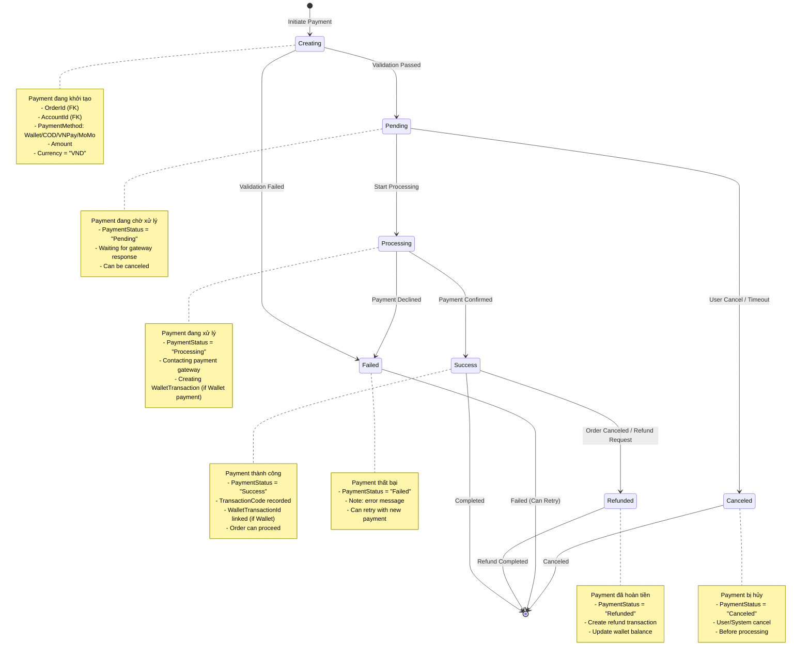

# Payment History State Chart

## 📋 Tổng quan
Sơ đồ trạng thái này mô tả vòng đời của **PaymentHistory** (lịch sử thanh toán) từ khi khởi tạo payment, xử lý, đến khi hoàn thành hoặc thất bại. Payment có thể qua nhiều payment methods (Wallet, COD, VNPay, MoMo) và integrate với Order & WalletTransaction.

---

## 🔄 State Chart Diagram



---

## 📊 State Descriptions

### 1️⃣ **Creating** (Đang tạo)
- **Mô tả**: Payment đang được khởi tạo
- **Properties**:
  - `OrderId` (int, FK) - Liên kết với Order
  - `AccountId` (int, FK) - User thanh toán
  - `PaymentMethod` (string) - Wallet/COD/VNPay/MoMo
  - `Amount` (decimal) - Số tiền thanh toán
  - `Currency` (string) - "VND"

- **Validations**:
  ```csharp
  // 1. Order exists and not paid
  var order = await _orderRepo.GetByIdAsync(dto.OrderId);
  if (order == null) throw new Exception("Order not found");
  if (order.IsPaid) throw new Exception("Order already paid");
  
  // 2. Amount matches order total
  if (dto.Amount != order.TotalAmount)
      throw new Exception("Amount mismatch");
  
  // 3. Payment method validation
  if (dto.PaymentMethod == "Wallet")
  {
      var wallet = await _walletRepo.GetByAccountIdAsync(dto.AccountId);
      if (wallet.Balance < dto.Amount)
          throw new Exception("Insufficient balance");
  }
  ```

- **Transitions**:
  - ✅ **→ Pending**: Validation passed
  - ❌ **→ Failed**: Validation failed

### 2️⃣ **Pending** (Chờ xử lý)
- **Mô tả**: Payment đang chờ xử lý
- **Properties**:
  - `PaymentStatus = "Pending"`
  - `CreatedAt` (DateTime)

- **Use Cases**:
  - **Wallet**: Direct processing
  - **COD**: Mark as Pending until delivery
  - **VNPay/MoMo**: Waiting for gateway callback

- **Transitions**:
  - 🔄 **→ Processing**: Start processing payment
  - ❌ **→ Canceled**: User cancel / Timeout (30 mins)

### 3️⃣ **Processing** (Đang xử lý)
- **Mô tả**: Payment đang được xử lý
- **Properties**:
  - `PaymentStatus = "Processing"`

- **Actions by Payment Method**:
  
  **Wallet Payment**:
  ```csharp
  // 1. Create WalletTransaction
  var txn = await _walletService.CreatePaymentAsync(new PaymentDto
  {
      AccountId = payment.AccountId,
      OrderAmount = payment.Amount,
      OrderId = payment.OrderId
  });
  
  // 2. Link transaction
  payment.WalletTransactionId = txn.WalletTransactionId;
  payment.TransactionCode = $"WLT-{txn.WalletTransactionId}";
  ```
  
  **VNPay/MoMo**:
  ```csharp
  // 1. Generate payment URL
  var paymentUrl = _vnPayService.CreatePaymentUrl(payment);
  
  // 2. Redirect user to gateway
  return Redirect(paymentUrl);
  
  // 3. Wait for IPN callback
  // Gateway will call /Payment/VNPayCallback
  ```

- **Transitions**:
  - ✅ **→ Success**: Payment confirmed
  - ❌ **→ Failed**: Payment declined

### 4️⃣ **Success** (Thành công)
- **Mô tả**: Payment thành công
- **Properties**:
  - `PaymentStatus = "Success"`
  - `TransactionCode` (string) - Unique transaction ID
  - `WalletTransactionId` (long?) - If Wallet payment

- **Side Effects**:
  ```csharp
  // 1. Update Order
  order.IsPaid = true;
  order.PaidAt = DateTime.Now;
  
  // 2. Update Order Status
  await _orderService.UpdateStatusAsync(orderId, StatusIds.Confirmed);
  
  // 3. Send notification
  await _notificationService.NotifyPaymentSuccessAsync(orderId);
  ```

- **Transitions**:
  - ↩️ **→ Refunded**: Order canceled, refund requested
  - ⛔ **→ [End]**: Completed

### 5️⃣ **Failed** (Thất bại)
- **Mô tả**: Payment thất bại
- **Properties**:
  - `PaymentStatus = "Failed"`
  - `Note` (string?) - Error message

- **Common Failures**:
  - Insufficient wallet balance
  - Gateway declined
  - Bank card expired
  - Network timeout

- **Transitions**:
  - ⛔ **→ [End]**: Can retry (create new payment)

### 6️⃣ **Refunded** (Đã hoàn tiền)
- **Mô tả**: Payment đã được hoàn tiền
- **Properties**:
  - `PaymentStatus = "Refunded"`

- **Refund Process**:
  ```csharp
  // 1. Create refund transaction
  if (payment.PaymentMethod == "Wallet")
  {
      await _walletService.CreateRefundAsync(new RefundDto
      {
          AccountId = payment.AccountId,
          RefundAmount = payment.Amount,
          OrderId = payment.OrderId,
          Reason = "Order canceled"
      });
  }
  
  // 2. Update payment status
  payment.PaymentStatus = "Refunded";
  payment.Note = "Refunded due to order cancellation";
  
  // 3. Update order
  order.IsPaid = false;
  order.RefundStatus = "Completed";
  ```

- **Transitions**:
  - ⛔ **→ [End]**: Refund completed

### 7️⃣ **Canceled** (Đã hủy)
- **Mô tả**: Payment bị hủy trước khi xử lý
- **Properties**:
  - `PaymentStatus = "Canceled"`

- **Transitions**:
  - ⛔ **→ [End]**: Cannot retry

---

## 🔧 Key Methods

### **PaymentService**
```csharp
// Create payment
public async Task<PaymentHistory> CreatePaymentAsync(CreatePaymentDto dto)
{
    var payment = new PaymentHistory
    {
        OrderId = dto.OrderId,
        AccountId = dto.AccountId,
        PaymentMethod = dto.PaymentMethod,
        PaymentStatus = "Pending",
        Amount = dto.Amount,
        Currency = "VND",
        CreatedAt = DateTime.Now
    };
    
    return await _repo.AddAsync(payment);
}

// Process payment
public async Task<bool> ProcessPaymentAsync(long paymentId)
{
    var payment = await _repo.GetByIdAsync(paymentId);
    if (payment == null) return false;
    
    payment.PaymentStatus = "Processing";
    await _repo.UpdateAsync(payment);
    
    try
    {
        switch (payment.PaymentMethod)
        {
            case "Wallet":
                await ProcessWalletPaymentAsync(payment);
                break;
            case "COD":
                await ProcessCODPaymentAsync(payment);
                break;
            case "VNPay":
            case "MoMo":
                // Wait for callback
                break;
        }
        
        payment.PaymentStatus = "Success";
        payment.TransactionCode = GenerateTransactionCode();
        await _repo.UpdateAsync(payment);
        
        return true;
    }
    catch (Exception ex)
    {
        payment.PaymentStatus = "Failed";
        payment.Note = ex.Message;
        await _repo.UpdateAsync(payment);
        
        return false;
    }
}

// Refund payment
public async Task RefundPaymentAsync(long paymentId, string reason)
{
    var payment = await _repo.GetByIdAsync(paymentId);
    if (payment.PaymentStatus != "Success")
        throw new Exception("Only successful payments can be refunded");
    
    if (payment.PaymentMethod == "Wallet" && payment.WalletTransactionId.HasValue)
    {
        await _walletService.CreateRefundAsync(new RefundDto
        {
            AccountId = payment.AccountId,
            RefundAmount = payment.Amount,
            OrderId = payment.OrderId,
            Reason = reason
        });
    }
    
    payment.PaymentStatus = "Refunded";
    payment.Note = $"Refunded: {reason}";
    await _repo.UpdateAsync(payment);
}
```

---

## 📐 Payment Methods

### 1. **Wallet Payment**
```csharp
private async Task ProcessWalletPaymentAsync(PaymentHistory payment)
{
    var txn = await _walletService.CreatePaymentAsync(new PaymentDto
    {
        AccountId = payment.AccountId,
        OrderAmount = payment.Amount,
        OrderId = payment.OrderId,
        IdempotencyKey = $"PAY-{payment.PaymentHistoryId}"
    });
    
    payment.WalletTransactionId = txn.WalletTransactionId;
    payment.TransactionCode = $"WLT-{txn.WalletTransactionId}";
}
```

### 2. **COD (Cash on Delivery)**
```csharp
private async Task ProcessCODPaymentAsync(PaymentHistory payment)
{
    // COD is marked as Pending until delivery
    payment.TransactionCode = $"COD-{payment.PaymentHistoryId}";
    payment.Note = "Cash on Delivery - Pay when receive";
}
```

### 3. **VNPay Integration**
```csharp
private string CreateVNPayUrl(PaymentHistory payment)
{
    var vnpay = new VNPayLibrary();
    vnpay.AddRequestData("vnp_Amount", (payment.Amount * 100).ToString());
    vnpay.AddRequestData("vnp_OrderInfo", $"Thanh toan don hang {payment.OrderId}");
    vnpay.AddRequestData("vnp_TxnRef", payment.PaymentHistoryId.ToString());
    
    return vnpay.CreateRequestUrl(_vnpayConfig.Url, _vnpayConfig.HashSecret);
}

// Callback handler
public async Task<IActionResult> VNPayCallback(VNPayResponseDto response)
{
    var payment = await _repo.GetByIdAsync(long.Parse(response.vnp_TxnRef));
    
    if (response.vnp_ResponseCode == "00") // Success
    {
        payment.PaymentStatus = "Success";
        payment.TransactionCode = response.vnp_TransactionNo;
    }
    else
    {
        payment.PaymentStatus = "Failed";
        payment.Note = $"VNPay error: {response.vnp_ResponseCode}";
    }
    
    await _repo.UpdateAsync(payment);
    return RedirectToAction("OrderDetail", new { id = payment.OrderId });
}
```

---

## 📊 Database Schema

```sql
CREATE TABLE PaymentHistories (
    PaymentHistoryId BIGINT PRIMARY KEY IDENTITY,
    OrderId INT NOT NULL,
    AccountId INT NOT NULL,
    PaymentMethod NVARCHAR(50) NOT NULL, -- Wallet/COD/VNPay/MoMo
    PaymentStatus NVARCHAR(20) NOT NULL DEFAULT 'Pending', -- Pending/Processing/Success/Failed/Refunded/Canceled
    TransactionCode NVARCHAR(255),
    Amount DECIMAL(18, 2) NOT NULL CHECK (Amount > 0),
    Currency NVARCHAR(10) NOT NULL DEFAULT 'VND',
    WalletTransactionId BIGINT,
    Note NVARCHAR(MAX),
    CreatedAt DATETIME NOT NULL DEFAULT GETDATE(),
    
    CONSTRAINT FK_PaymentHistories_Order FOREIGN KEY (OrderId) 
        REFERENCES Orders(OrderId),
    CONSTRAINT FK_PaymentHistories_Account FOREIGN KEY (AccountId) 
        REFERENCES Accounts(AccountId),
    CONSTRAINT FK_PaymentHistories_WalletTransaction FOREIGN KEY (WalletTransactionId) 
        REFERENCES WalletTransactions(WalletTransactionId),
    CONSTRAINT CK_PaymentHistory_Status CHECK (PaymentStatus IN ('Pending', 'Processing', 'Success', 'Failed', 'Refunded', 'Canceled'))
);

-- Indexes
CREATE INDEX IX_PaymentHistories_OrderId ON PaymentHistories(OrderId);
CREATE INDEX IX_PaymentHistories_Status ON PaymentHistories(PaymentStatus);
CREATE INDEX IX_PaymentHistories_TransactionCode ON PaymentHistories(TransactionCode);
```

---

## 🎯 Business Rules

1. **One Payment Per Order**: Mỗi order có 1 payment primary
2. **Amount Match**: Payment amount = Order total
3. **Atomic Processing**: Payment + WalletTransaction + Order update phải atomic
4. **Idempotency**: Prevent duplicate payments
5. **Refund Only Success**: Chỉ refund payments thành công
6. **Timeout**: Pending payments timeout after 30 mins

---

## 📝 Summary

### **States**: Creating → Pending → Processing → Success/Failed/Canceled → Refunded

### **Key Properties**:
- `PaymentStatus` - Pending/Processing/Success/Failed/Refunded/Canceled
- `PaymentMethod` - Wallet/COD/VNPay/MoMo
- `Amount` - Payment amount
- `TransactionCode` - Unique transaction ID

### **Integration**:
- **Order**: Update `IsPaid`, `PaidAt`
- **WalletTransaction**: For Wallet payments
- **Notification**: Notify payment success/failure

---

**Created by**: AI Assistant  
**Date**: 2025-11-05
